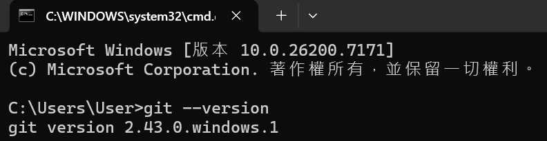
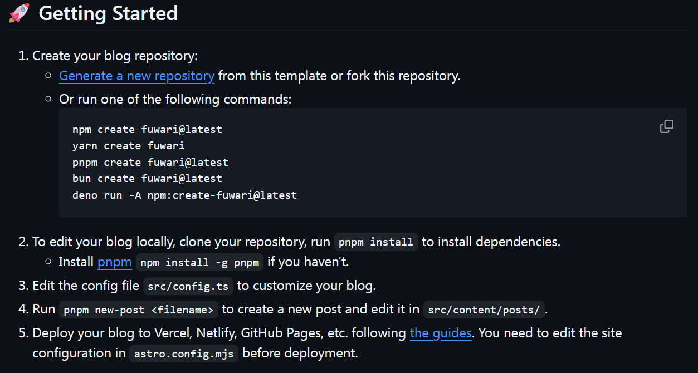
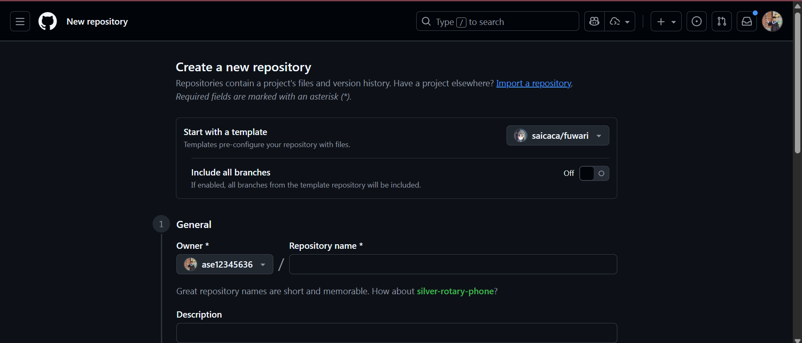
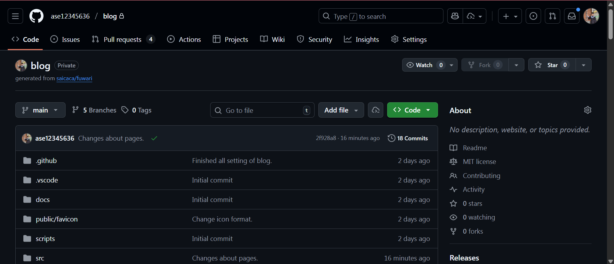

## 前言
這篇文章比較像是我架設過程中的一個記錄，雖然現在已經是架設後兩天，可能或多或少會有一些缺漏，但是我會盡量把我架設過程中有遇到的事情記錄下來。

我猜在開頭，有人會想問一個問題，為什麼我不用幾個比較多人用的框架，像是：Hexo、Jekyll、Hugo。其實我一開始也是打算要用這幾個常用的框架，畢竟網路上的說明與資源也比較多。但是我遇到一個很大的問題，就是挑選網站的主題。我在這些工具的主題網站逛了很久，我其實找不到幾個我覺得順眼的主題。或者說有找到幾個不錯的，但是看起來已經年久失修沒有人在維護了。

這時候，我打開了Google大法，輸入了這些關鍵字：「Github pages blog 推薦」，然後第一個搜尋出來的結果就是Fuwari的github頁面。點開來看了一下Demo網站後，我只有一個心得，就是這個了！這個幾乎符合了我所有的需求。當然，我不會說用Fuwari架設就一定最棒，還是看每個人的需求。

至於，我到底是需要那些需求，大概就是我想要他華麗但是不要太華麗。架設不要太困難，其他基本的功能有就好。對，聽起來是一個很容易的需求，但是我覺得我口味比較挑一點就是XD
### Github pages介紹
這是一個github提供的服務，所以如果你想要用github page，請你先去註冊一個github帳號。我沒有打算要在這邊做github帳號註冊教學。這個服務主要是提供一些人想要架設一個靜態網站（沒有後端的網站），但是又不想花錢去租或者管理一個伺服器與domain的人，一個很棒的解決方案。換言之，就是一個不用後端的懶人伺服器服務。

## 環境確認
### git
如果你電腦沒有git，請去安裝一下。<a href="https://git-scm.com/" target="_blank">git</a>的下載連結，請自行參考。至於，如果你不知道git跟github之間的關係，請你現在關掉這個網站，因為這代表你可能比較適合用的是別人提供的blog網站，不要自己架設一個。

安裝好後，可以在命令提示字元（或powershell）輸入`git --version`，如果有安裝成功會看到以下的畫面：

如果沒有，請檢察你系統環境變數有沒有設定好，或者是有沒有安裝成功，這邊不再贅述。

### node.js

## Fuwari教學
前面提到了三種常見的框架，像是：Hexo、Jekyll、Hugo。Fuwari都不是基於他們三個，他是基於Astro設計出來的blog模板，所以在使用Fuwari架設blog的時候，或多或少會與Astro扯上關係。

畢竟這篇文章想要教你怎麼用Fuwari去在github page上架設一個blog，所以請先打開<a href="https://github.com/saicaca/fuwari" target="_blank">fuwari的github</a>往下滑可以看到fuwari有提供一個Getting Started，可以直接照著他的步驟來做，基本上會達成一樣的效果。如果你懶得滑，我幫你把截圖放在這邊：

不過我還是會一步一步操作，告訴你們大概要怎麼操作。

### Step1: 生成reporitory
請點選<a href="https://github.com/saicaca/fuwari/generate" target="_blank">Generate a new repository</a>，這時候你應該會看到這樣的畫面：

如果你沒有之前沒有創建過github page的人，你reporitory可以叫`username`.github.io。`username`請換成你自己的github的username。如果你跟我一樣，是已經架設過github page的人。你可以就自己隨便選一個名字去創，我的是叫做blog。這個名字後面還會用到，請好好取名字。創建好之後會長得像是下圖的畫面：

