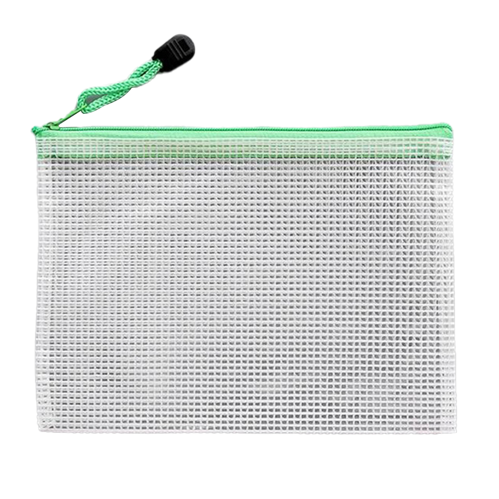

## 前言
在臺灣，只要你是一個雄性人類，一生中一定會遇到一個問題，就是當兵。很多人會把當兵當成人生的一個重要轉捩點，甚至在老一輩口中會聽到：「當兵會讓你從男孩變成男人。」我先不針對這句話做一個評價，但是可以見得當兵會是臺灣男性每個人的必備考題。

不管你當幾天的兵，只要你當過兵，在你的人生中一旦有人開啟了當兵的話題，就一定會聊起來。算是某種臺灣男性的共同話題。至於到底為什麼？我覺得大概就像是大家都吃過屎，在比誰吃過的屎比較難吃，或者個別吃的屎有沒有什麼特色。畢竟是軍隊，不用期待裡面會讓你多舒服，這是正常的。所以就變成了某一種共同回憶吧。

當兵役期分成很多種，有一年、四個月的常備兵部隊，也有當替代役去新訓中心受訓的新兵，我比較幸運因為總總原因我成為了十二天的補充兵。換言之，我只有吃到十二天的屎，但是也吃到了不少的屎。還是一句話：「能吃飯為甚麼要吃屎呢？」

## 什麼是補充兵
如果你對於臺灣兵役義務的結構不太了解的人，或許不太知道補充兵到底是一種什麼東西？~~簡單來說：軍中之癌。~~

還是認真解釋一下補充兵的制度，簡單來說就是給予家庭特殊條件以及身體因素等原因，實施十二天的軍事訓練後，即轉為後備軍人的一種兵。簡單翻譯，就是你有問題，我不敢把你丟在軍營當成一般的兵來操練，或怕把你關在裡面太久，會對於社會有不良影響，但是法律你又一定要當兵，所以把你關進來十二天之後丟你出去的一種特殊兵種。

很瞎對吧？對我也覺得，所以十二天的補充兵根本就不會學到戰鬥技巧，你也不太有機會碰到槍（不過我有碰到，故事後面再說），但是你還是一名二兵，你就還是一隻軍人。以我們教育班長的說法：「你們就是一群來做防災、救災之類的，補充一般兵的缺口的兵。」雖然我比較喜歡班長的另一個說法：「~~就是一群小王八蛋。~~」所以說，從另一個角度來說，就是一群在做雜工的兵，畢竟十二天你能幹嘛？帶我打靶嗎？等等不小心打到自己ouo

至於爽不爽嗎？我可以關比較短，這方面來說是真的很爽啦！但是在裡面的生活喔，是有比常備役跟替代役爽，但是我覺得還是吃了不少屎倒是真的。

## 為甚麼我是補充兵
這邊就是有趣的地方了，首先各位要先知道一個前情提要：「我就是傳說中的83年次至93年次的超爽人類。」如果你知道這是什麼意思，你現在已經開始眼紅我了。如果不知道的我解釋一下，我們就是那群只需要當四個月的爽兵。所以我就算是常備役我也只需要當四個月喔！真的好爽！

好，在解釋到底為啥我是補充兵之前，要在解釋另一個事情，叫做體位判定。（就是最近新聞炒很兇的東西，聽說改成幾乎是你只要腦袋還在，就要當兵的樣子）體位判定分成結果：「常備役、替代役、免疫。」某位友人說的：「~~正常、半殘、全殘~~」所以這邊你可以知道一件事情，我肯定不是常備役，因為如果我是，那我今天就是寫四個月的心得，我也不是免疫因為那個是不用當兵。所以說我的體位判定結果就是替代役體位。

既然叫做替代役體位，換言之我應該是得去服替代役才對。其實我原本一開始也是這樣想的，但是後來我發現替代役只有一種役期就是一整年的作法，好像沒有四個月的替代役。經過一番才找我才發現我們這種原本是四個月的爽兵，如果判為替代役體位，就會去當十二天的補充兵。嘿！沒想到吧！我原本以為我要被抓去當替代役四個月，結果我是改服補充兵了！至於為甚麼我是替代役體位，主要是兩個原因：「我有氣喘且有持續就診，一年內有復發紀錄、我的BMI過高。」我沒有蓄意逃兵就是，反正我就是體位判定怎樣就怎樣，所以我也沒有硬去拚免疫之類的。

## 攜帶物品
我是一個相信區公所的人，所以我帶進去的東西其實很少，我後來在營站買了很多生活用品。我這邊推薦如果有要去進去的人，可以在外面多買點自己習慣用的東西。至少我是挺後悔有些東西沒有在外面買的。
### 我攜帶的東西
- 證件們（身分證、健保卡、學生證（拿來當悠遊卡用））
- 補充兵徵集令（務必要帶，不然你就白當兵了）
- 存摺正本封面影本
- 個人印章
- 現金（20張100元紙鈔、100個10元硬幣）
- 個人藥品（防曬乳、防蚊液、小護士、平常用藥）
- 刮鬍刀（不是電動的）
- 指針手錶
- 密封袋 * 2
- 手機（iPhone XR）
- 行動電源
- 充電線
- 三隻筆（紅、藍、黑各一）
- 輕小說 * 8
- 論文 * 4

### 在營站買的東西
- 牙膏、牙刷
- 識別證套
- 口袋式防水袋（長得像是下圖，主要拿來放你要背的報告詞）

- 藍白拖鞋
- 衛生紙
- 衣架 * 5
- 三合一洗潔劑（這東西超她媽難用，我結訓前送給一個學長（或者說班長）了）

大概以上兩個清單，我覺得可以自己斟酌那些東西要不要自己帶進去，大部分都可以在裡面買到。不過牙刷，是我最後悔沒有自己帶的，裡面的牙刷刷頭都還挺大的，我平常用的都偏小。不過這屬於我個人習慣問題，當然你不介意的可以在裡面買就好。

現金我覺得我用的是剛剛好，差不多被我用完。但是我開銷算是比較大的，因為我一直跑去投飲料（後面會解釋）所以可以自己斟酌數量。但是也不要帶太多，聽說之前前幾梯有人被偷，雖然我們這梯是還好。塑膠袋可以多帶幾個，在裡面有時候整理東西挺好用的，不過也可以去營站買東西，之後就會有塑膠袋了。

## 結語
在原先規畫中，我想要打成一大篇的補充兵心得，但是我發現內容有點太長了，所以我決定拆成四篇文章來發。後面預計會更新補充兵的日常跟我的特殊回憶們。

雖然我才當短短的十二天的兵，但是真的很多東西可以分享。現在還沒到最精采的部分，現在才剛打開一個很開頭故事。後續敬請觀看？

