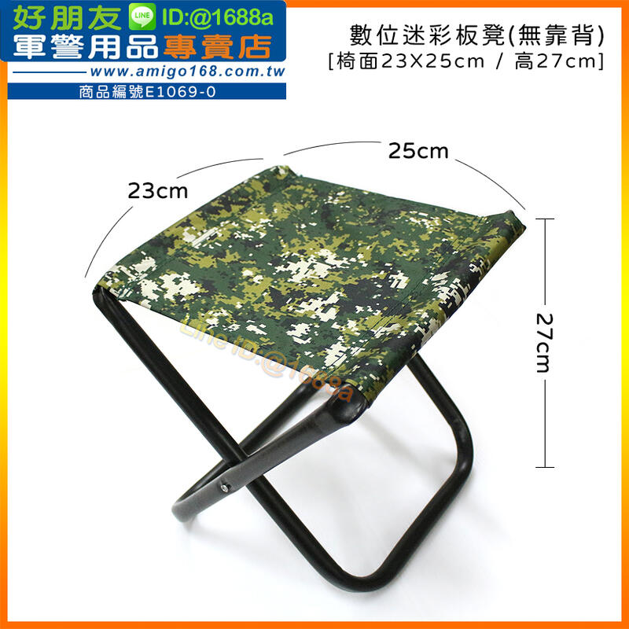
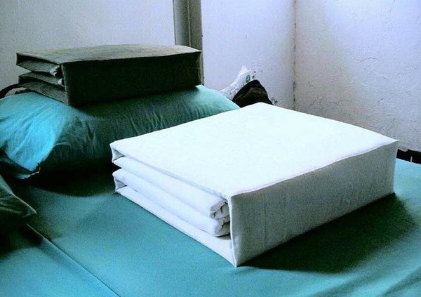
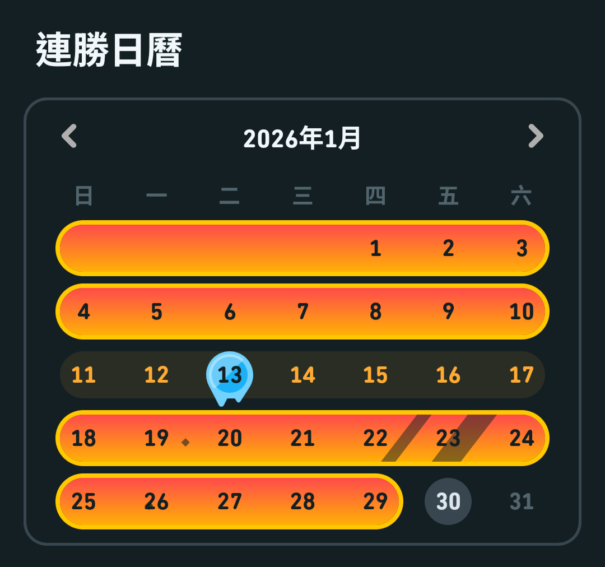

## 前言
這篇是補充兵之旅的第二篇，在前篇我講了甚麼是補充兵，跟為什麼我是補充兵，還有一些用品的準備。這篇我打算講講到底補充兵這十二天都關在裡面幹嘛。這篇會比較像是一個普通性的一種概述，很特殊或者比較特別的回憶不會出現在這篇，請期待之後相關篇章的出現，所以沒意外的話我猜大多數補充兵可能生活都差不多？不過一切都是以你的收訓單位為主，就算是同一個收訓單位，幹部不一樣也可能會有差異，所以本篇內容僅供參考。

有些背景知識可以先了解一下，我是在臺南大內營區的137旅步四營步一連，然後我是六班054號。有一串我稱為魔法數字的東西，就是在描述前面這些資訊，基本上你到的第一天你的班長就會要你把它背起來了。我的這串魔法數字是137R4B1C 6-054。我們這梯的人員主要來自高雄、屏東以及臺東。

在我們剛進去第一天班長就指示五班六班是打飯班，這十二天內打飯班都不會輪調，所以我就被這樣分配到打飯班。打飯班的故事很複雜，我會在下篇的一段專門描述打飯班的工作內容，有很多幹事會打在之後提供大家閱讀。然後因為我剛好是在農曆年前入伍的（01/12 - 01/23），所以剛好遇到營區內要做大掃除跟裝備清點，所以有些公差內容描述會講到這一塊。我不太確定這個清點跟整理的頻率多高，所以說可以參考一下部分看起來很忙的內容。

網路上很多人補充兵感覺過得很爽，我這邊的只能說：「他媽的好累。」

## 補充兵都在幹嘛？
各位都知道，其實四個月的兵或許連軍事專長可能都沒辦法好好學完跟訓練了。哪請問我們這些12天的兵到底是要幹嘛？實在話我進去前我都也搞不懂。網路上眾說紛紜，訊息難以辨識真偽。所以我到進去之前我都還是沒有搞懂我們到底要幹嘛。這邊我來跟各位分享一下到底這十二天我都遇到了甚麼？不過我不會用流水帳式的方式打，我會分成三個時間段跟一個特別任務來解說。三個時間段有：「剛入伍期、平日、週末」跟特別任務：打飯班。在這篇中，我只會講完剛入伍期跟平日，周末跟打飯班就一起留到下一篇來講。先說，~~打飯班狗都不當。~~

## 剛入伍期（前三天）
從車站到軍營，是有遊覽車接送我們的。還記得車上的氣氛真的是有夠凝重，我全程看著窗外思考著到底要被抓到哪裡去。還記得在車上看到營區的門口。到了下車看到一堆板凳，我整個人都還是很矇。先說那個板凳可不是好坐的板凳，請參考下圖：

相信我，這東西真的坐著很不舒服，因為真的很矮。完全不符合人體工學的大便，不知道哪個天才設計的，完全難以理解。下車後不久，就按照戶籍地去分班。之後就是連長講話，然後開始發資料，之後就是一直寫資料一直寫資料。雖然說是一直寫，其實也才兩份資料跟一份被稱為報告詞的東西，報告詞上面就是寫一些注意事項跟軍歌歌詞（先抱怨，陸軍軍歌真的很難背起來）。在寫資料的過程中，你會發現很多資訊其實你不知道，像是：你祖父的出生年月日（還是只有我不知道，不可能吧）。這時候上午還沒收手機，就要趕快問，如果沒有寫當時班長說會處分（雖然最後好像也沒有）。我還記得有欄位是要寫自己最好的兩個朋友的生日跟手機號碼，我還在那邊傳訊息問。其中一位友人：「你是要幫我簽下去是不是？」有些資訊或許進去前可以先問好，至少我是進去後才知道會用到這些資訊。在寫資料的過程中，會進行一個環節叫做安全檢查跟沒收違禁品。違禁品的定義是說：「所有口服藥物（氣喘藥物不算）、充電器（包含有插頭的行動電源）、所有線材、所有有藍芽功能的設備、打火機。」這些東西需要繳出來，然後其他東西要攤在地板上給長官檢查。在收違禁品的時候，我的密封袋就很好用了，因為我可以把我的東西丟在密封袋中，這樣就比較不會跟其他人的混在一起。

在中午去吃飯前，班長就把手機收走了。從這一刻開始，我就失去了我對於手機的自由使用權了。再來就是被剃頭、領裝備（一件迷彩外套、一件運動外套、兩件褲子、**兩件迷彩內衣、兩件內褲、兩雙襪子、一雙運動鞋、一個水壺**，粗體的是可以自己帶回家的）之後就是繼續寫資料跟被帶去營站買日用品。順帶一題，因為我們是補充兵所以很多東西是所謂的前人的遺物，亦即板凳、不能帶走的裝備、S腰帶們，大概都是N手品，可能年紀比我們都大也說不定。之後就是開始幫手機灌MDM，灌MDM這件事情我記得花了兩三天，我這邊只能說國軍的MDM真的是軟體工程的一種傳奇。有聽說Android的比較會有問題，這邊誠摯推薦各位攜帶Apple的手機進去。然後不推薦用自己的主力機，畢竟我覺得那東西會不會對你手機做些什麼奇怪的事情，我不知道。

因為我們這梯人員來自四個地方，所以會有些人比較早到有些人比較晚到。在我們準備去午飯的時候，屏東跟臺東的人抵達了，這時候畫面就變得有點有趣。因為我們這些比較早抵達的已經開始寫資料了，所以班長已經跟我們解說完要怎麼寫了，甚至說很多人已經寫完資料再看報告詞了。後面那些晚到的人還需要重新解說，畢竟他們沒有聽到。這時候就會發現前半區會有一個班長在下達一個指令，後半區會有另一個班長在下達另外一個指令。因為我剛好是前半區的最後一班（因為旗山區算小區，大區的人都在前面，小區的最後全部塞在一起），所以我就會聽到前半區跟後半區的指令。那時候就看到士官長臉很臭，在那邊碎碎念說：「到底在幹什麼？又不是第一次接兵了還搞成這樣balalala。」

大概前三天我都算是剛入伍期，雖然還是會出公差，不過很多時候都是寫資料跟安裝MDM，還有一些基本教練中度過，像是：軍歌、站姿、隊形、內務整理教學、軍人的基本禮儀之類的。基本教練的時候其實滿好玩的，雖然做錯會很尷尬，如果一職重複做錯可能還是會被電，但是就是就是看到一大推人聽到指令跑來跑去，那個畫面根本就是老鷹抓小雞，然後小雞一大群人這樣。不過也合理，畢竟前三天就是菜雞，各種基本的軍人訓練都會出現，基本上前三天你一些事情做錯大概都還不會被罵太兇，但是一定會被糾正倒是真的。還記得第二天晚上因為大家陸軍軍歌沒有背熟，導致當天晚上沒有手機可以用。一直在練習陸軍軍歌，雖然我沒有練習到因為被抓去出公差，至於甚麼是公差我後面在解釋。

大概前三天的菜雞期就這樣度過了，之後開始就是平日的日常生活（被當成雜役的生活）。至於我前面講到的出公差，就是接下來的日常。只能說出公差這種事情真的就跟雜役差不多了。

## 平日
在經過這十二天的生活後，我覺得我對於補充兵的理解就是服繇役。可能服繇役還比較好一點，因為你可以不用自己花錢。我們在入伍後不久班長會讓大家繳錢，基本費用大概是七百多塊，項目包含：洗衣費、個人照費。然後你可以額外加購團體照。然後個人照通常都拍得很醜，畢竟你是一顆光頭（我都說是滷蛋），然後攝影師就是基本的有拍到就過了。每個人拍出來都像是入獄的照片，不開玩笑，我看著我那張照片你說我是監獄剛出來的大哥我都信。團體照就是一群滷蛋的合照，有護貝然後七百多元，就見仁見智，反正我是跟別人一起合買我拿兩張他拿兩張這樣。所以我這邊說可能秦始皇人都還比較好，扶繇役還不用交錢，我們被抓來服兵役義務還要交錢喔！

### 每日行程

其實如果全部都按照表定來說的話，我們應該是早上六點起來，六點十分下樓集合。但是實務上因為你起床要去摺棉被跟蚊帳，還要換裝跟整理一下內務，我那時候通常是五點半我就會起床來準備這些事情了。我人生第一次這麼健康，早上五點半起床開始做事情。至於摺棉被跟蚊帳，大概就是跟各位所傳聞中的折豆腐那個概念一樣，如果你不知道我在講什麼，請參考下圖：

不過因為我們是補充兵，所以實務上對我們要求並沒有這麼嚴格，引用我們其中一位班長的話：「你們的內務跟被中共打到差不多。」所以基本上我們就是努力折，那個形狀大概有到就差不多了。雖然我到現在都還是沒有很搞懂這樣做的用途到底為實際戰力有沒有任何幫助，反正在裡面就是一句話：「服從。」整理完床鋪後，就會下床穿運動外套 + 迷彩外套，拿上我們前面提到的板凳，之後繫S腰帶（水壺記得要裝水），之後就下樓集合準備早點名。因為我是打飯班我沒有參加過早點名，不過聽說就是升旗典禮加上長官講話的樣子。然後升旗典禮要唱軍歌，這時候國歌跟陸軍軍歌就會派上用場了。不過還是一句我是打飯班我是沒有參加過，所以我也不知道要我背陸軍軍歌要幹嘛？陸軍軍歌好像只有在早點名才會使用上，真的是。

之後的流程就是：早餐 ＞ 出公差 ＞ 午餐 ＞ 出公差 ＞ 晚餐 ＞ 洗澡 ＞ 滑手機 ＞ 小盥洗&打掃 ＞ 就寢（大約在九點到九點半）。大概一天就會這樣過了，至於到底出公差是什麼意思？簡單來說就是這個營區的所有地方，如果有缺雜役，就會有人過來把我們帶走去完成雜役任務。不過因為打飯班有點特殊，所以相對來說我出的公差性質沒有到這麼多元（畢竟我們會比其他人還要早被要回來，這部分後面我再來說明）。

我有出到的公差大概有以下內容：
- 掃地、拖地
- 掃廁所
- 組床架
- 搬床板、床墊
- 幫忙其他連整理寢室（折棉被）
- 搬經理裝備
- 搬軍械
- 掃水
- 當人體傳送帶把裝備從庫房拿出來
- 保養槍械

從其他人口中還有聽到以下公差內容：
- 刷油漆
- 刮除壁癌
- 出營區幫忙搬裝備

公差內容基本上大概就這些，簡單翻譯就是一個各種雜役沒有錯！不過有一些我猜應該是因為我們入伍時間剛好遇到要做裝備清點，所以才會出現的公差，像是搬軍械跟保養槍械。聽說大多數的補充兵是不會碰到槍的，我們可能是少數有碰到槍的補充兵。不過也就只有保養槍械而已，也沒有太多。那些步槍也都是非常老式的步槍，很多把我個人推測可能都沒辦法打也說不定。不過我相信應該是因為這邊是新訓單位所以槍械都這麼奇怪。至於掃水的部分，我覺得是我們這次的特殊事件，但是這部分就留到之後的特別回憶中，餐廳淹水事件再來講。反正就是拿畚箕跟水桶一杓一杓的把水從餐廳掃除掉。

不過這些公差內容我覺得基本上都差不多，最大的差異就是在帶隊班長跟公差地點。這兩個因素通常就是天堂與地獄的差別了。像是我有聽說去二級場出公差的同梯，他們每個出完都懷疑人生到不行，聽說到最後還有人跑去打1985投訴二級場的樣子。不過我是沒有去出到二級場的公差過，可能我的運氣還挺不錯的。不然感覺心得文可以多很多內容XD 基本上我有出公差到過的地點有一連、二連、火力連跟砲兵連。這裡面我覺得最爽的是砲兵連，因為位置在營站的旁邊，帶隊的班長休息時間都直接放我們自己去營站買東西，不要買到太誇張他都不會有意見。雖然那次公差也是挺累的，就是在組床架、搬床板跟床墊那些東西。重量不會說到特別重，但是很熱跟很悶到是真的。而且數量很多導致會挺累的。

至於帶隊的班長，這個就很講究了。在軍營中會來把我們帶走的班長（通稱）有四種類型：義務役士兵、志願役士兵、士官、軍官（廢話，軍中就這四種生物）。通常帶隊的人如果今天是士兵，高機率這趟公差會挺涼的，因為士兵自己也不是很想弄，雖然抓到了一群人來一起弄但是他還是不想弄。這時候呢！就會發生士兵帶著我們一起偷懶，做完一些很基本的內容就好，不會太嚴格。當然也有一些士兵帶隊也是很嚴格，但是大多數都是挺快樂的。而且通常士兵帶隊，還有一種很棒的特性，就是會帶你去營站跟萊爾富（營區內的便利商店）。補充一下，營區內有四個買東西的地方：販賣機、小蜜蜂、營站跟萊爾富。基本上只要不要再奇怪的時間，販賣機對於補充兵來說就是隨便去投。小蜜蜂出現的時間，基本上你的穿著得體，基本上也都可以去買（聽說小蜜蜂只會在你可以買的時候出現，所以說不用太擔心買了會被罵，但是要穿個像的人再去買）。但是營站跟萊爾富就不太一樣，這兩個地方你是一定要班長或者某人帶著你去才可以去。還到前面說的，如果今天士兵帶我們出公差，多數情況下凹一下，他們都挺願意帶我們去的。不過當然該有的秩序還是要有，像是要兩兩成行走路之類的。不過這種福利就真的超級爽！不過如果是士官或者軍官（這很少見），就很高機率會比較嚴格。不過也是有很棒的人啦！所以說都很難說！

### 特殊事件：招募員招募
在出公差以外，有時候會有一種特殊事件，叫做招募員招募。簡單來說，就是一群人來問你要不要簽下去，跟你說簽下去多棒多棒之類的。基本上有招募員來，被抓去聽招募的人就可以不用出公差，然後因為他們基本上就是跟你聊聊天，或者他們講你在底下聽。這也使得招募就是一個很爽的時候，因為基本上就可以不用做事情了！很涼！真的很涼！我也是在軍中第一次體驗到大學學歷的重要性，因為有些招募會只找大學學歷以上的人去聽。然後因為招募員通常都是士官，有時候他就可以幫你凹一些福利出來，像是把你的手機還給你之類的。你就可以在召募員附近快樂的使用手機！招募根本就是我這十二天遇到最爽的特殊事件！而且如果跟招募員比較熟（就是他有記住你），有時候他在附近閒晃，你可以跑去找他聊天，之後你就會有一段時間的歸屬權在招募員手上！然後如果有需要還可以可以跟招募員凹一下去拿手機出來使用！雖然我說招募員人這麼好，但是我要不要簽下去齁。我不要。不過有些招募員也會跟你說：「我其實也不覺得你應該要簽下去，因為你還有夢想，等到你某一天沒有夢想了，不知道要做什麼的時候。如果你還可以簽下去，你再回來簽下去。」不得不說，有些招募員不見得是為了業績一定要遊說你簽，他們可能也只是希望你這十二天的軍旅生涯可以找人聊聊天，不要太痛苦而已。

### 滑手機
在現代的時代，網路已經是一種基本人權。但是你要知道當兵代表著，你放棄了你身而為人的所有權利，包含但不限於你的網路使用權。以我們的收訓單位來講，我們基本上是一天放一次手機，放手機時間大約在一到兩個小時左右。事實上確實是這樣，我們只有一天沒有放手機，就是在第二天的時候。因為大家陸軍軍歌都沒有背熟，加上那天又有搬經理裝備的公差要出，這也使得我們在十二天中只有那一天沒有拿到手機。其實我不算是網路的重度成癮使用者，我又是一名單身男子，所以對於我來說我拿到手機只有一項任務：解多鄰國。對，不用懷疑我只有這項任務要做，所以對於我來說解多鄰國完成後，我就會陷入一個不知道要幹嘛的情況。

我們要講一些前情提要，滑手機不是他發手機給你，之後你可以跑去任何一個地方用手機。我們滑手機之前會先拿著板凳到連集合場集合（反正就是一個戶外的籃球場），之後大家坐在板凳上。之後開始滑手機這樣。所以說，對於我來說我解完多鄰國之後，我就會陷入一個很尷尬的問題，很多人再打電話給女朋友報平安，或者打給家人之類的，但是我沒事幹了。我後來有幾天打電話給家人，不過也就講一下我活著大概這樣，也不知道可以講啥。好像很多事情對我來說都可以出來在處理到是真的，所以這使得我在那時候就會變成得在那邊吹風不知道要幹嘛。很荒謬的情境對吧？我也覺得。不過我覺得我們班長對我們這樣的管理是挺仁慈的，雖然對我來說還好，不過我看大家每天打電話報平安，我覺得對於軍中生活是一種調劑。反正我是都去找多兒報平安，附上我多鄰國的連勝紀錄：

## 結語
終於打完了這篇關於補充兵的日常到底都在幹嘛的畫面，有些太瑣碎的像是洗澡之類的我就不打了。不過也有一些有趣的事情統一更新在最後一篇的回憶中。從這篇文章中你可以發現補充兵大多數時間都管理的比較鬆一點，不太像是常備役在新訓中心那種感覺。不過也正常，我們才十二天管太嚴格也沒什麼用途。~~我們就是一群軍中之癌。~~

下一篇會更新一下周末的部分，因為補充兵周末是不會放假出去的，我們唯一次出去的時間只有結訓退伍那天。然後就是最精采的打飯班的工作內容，請各位期待下一篇的更新。