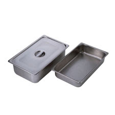
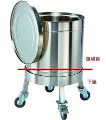
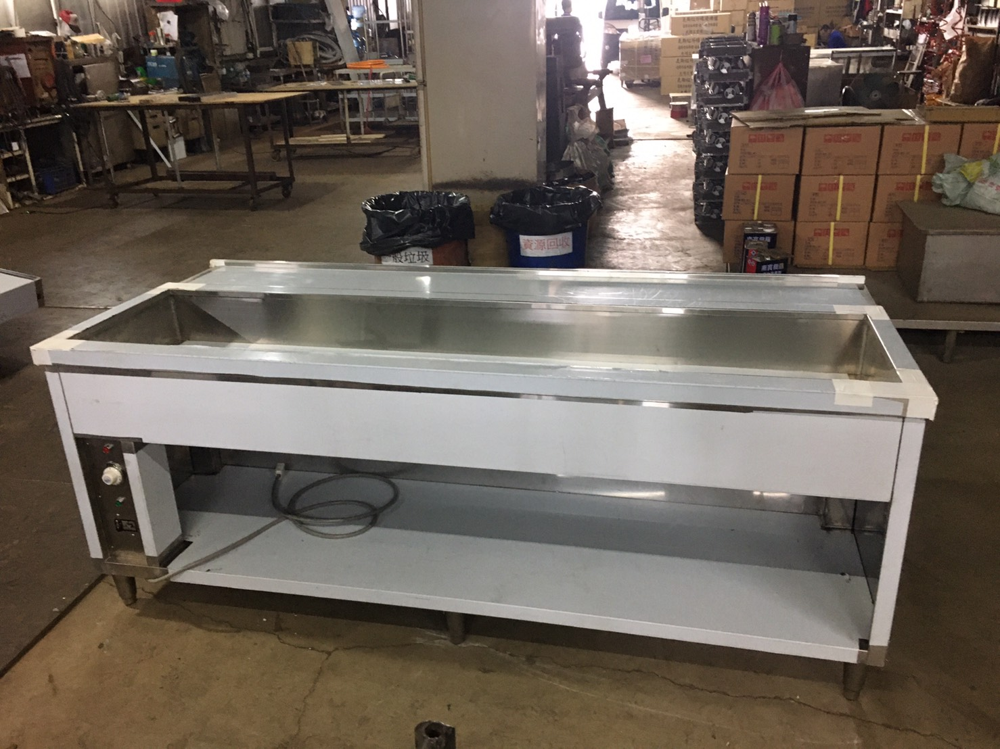
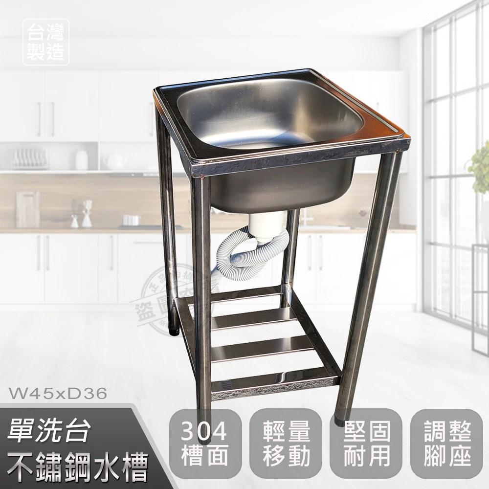
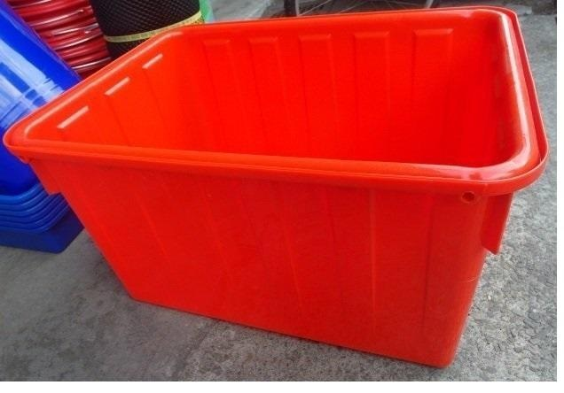
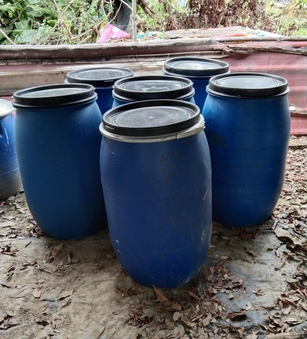

## 前言
在前一篇，我把補充兵的平日大概都講完了。基本上如果你只是好奇補充兵到底進去在幹嘛，或許只需要看到前一篇就結束了。這篇以及下一篇我覺得比較偏向是special case，完全是根據你的運氣以及收訓單位，這個差異性可能不只是地球跟月球之間的差異，也比較偏向慢慢地走到我的回憶以及專門心得篇。所以說，如果你是想要聽一些有趣的故事或者說荒謬的事情，歡迎繼續收看補充兵之旅第三集。

因為補充兵只有短短12天的役期，所以基本上我們都還算是在最基本的新訓階段。就跟常備役差不多，我們週末其實是沒有放假出去的，是繼續關在營區裡面。所以說，週末就會是一個比較有趣的狀態，畢竟連上的長官們有些也放假出去了。至於打飯班的部分齁，基本上就一句話：「~~狗都不當。~~」

## 週末
接續前言，基本上常備役只要下部隊，或者說志願役的人，基本上是見紅就休，換言之就是有放假與週末的概念。雖然他不是一個保證你一定可以休到，畢竟有可能輪到你要留守在營區裡面，但是原則上就是不會有太多人在營區中。這也反映在我們的幹部身上，我們幹部很多都休假了。如果我記憶沒錯的話，留下來的人只剩下士官長、班長、一兩個兵這樣的結構。加上跟我們剛好差不多時間的常備役的新訓人員，這個週末要放墾親假。所以說這整個營區基本上都沒有什麼人，這也會使得基本上我們也沒有什麼公差可以出，頂多就是掃掃地，整理環境之類的。真的是非常的閒，畢竟閒到我們第一次在聽補充兵應該要聽的課程內容，所以說週末就相對起來比較悠閒。

俗話說的好：「不怕一群男生聚在一起，就怕一群男生聚在一起又沒事做。」所以我們連上留守的人員們，就安排了幾個活動讓我們玩一下，不然理論上週末的兩天真的會閒到發慌。

### 活動一：籃球比賽
在周六的時候，士官長突然開始要我們挑出十位壯丁。所謂的壯丁定義：「會打籃球的人。」先說，我不會打籃球，所以我全程在旁邊看戲。叫我打籃球大概跟要我三招之內放倒呂布的概念差不多，只能說：「你要確定欸。」

在一開始的時候，基本上都沒有人要舉手。真的是所有人都不知道要幹嘛，所以完全沒有人要自願的部分。在軍中這種地方，我一直堅守一個原則：「安靜不要惹事，不要當出頭鳥。」我猜很多人應該也是這種心態，不知道士官長要幹嘛，所以大家都很安靜地不動作。最後，士官長要求每班抓出一兩個人出來，這時候就是大家開始互相亂指名的時間。反正，最後還是找出了十個人出來。在這時候，士官長才說到底抓十個人出來要幹嘛？簡單來說，營區中有些長官也留守，所以他們想要來跟我們補充兵打一個籃球比賽。我個人推測，他們應該想說補充兵都是老弱殘兵，所以想跟補充兵打打籃球比賽找回一下自信吧？不然就是他們真的太無聊。

他們是打全場的籃球，5 v 5的結構。我們抓出了十個壯丁，所以說分成兩隊下去跟長官們比賽。然後沒有上去比的人，就坐在場邊看他們打。先說結果，比賽狀況異常得很精采，一部分是你會被旁邊的氣氛渲染到，另一部分是那個比數真的是十分的跌宕起伏。在第一場的開頭，基本上長官被完封，補充兵這邊基本上拿到了四分還五分，長官那邊還是零分。這個比分齁，我很高機率懷疑這群補充兵應該要改服常備體位。大概到中段，我們這邊的人因為前半段進攻太猛有點力竭，被長官們拿下了幾分。之後他們調整了一下節奏跟步伐，之後就把長官們給打爆了。

在這第一局比完後，我真的高度懷疑這群人真的是補充兵嗎？他們體能根本就可以服常備役吧？真的是，給我回去四個月。

在第一局打完後，換另外五個人上去，這邊基本上就是正常的補充兵表現了。我們直接被長官打爆了。大概這樣打了一個下午的籃球，就去吃晚餐了。

### 活動二：卡拉OK
有鑑於是週末，基本上可以想像不會跟平日有差太多，當然還是會被抓去出公差。只是有些時段會變成活動時間而已，自然晚上就是我們的滑手機時間。在我們滑手機剛發手機後不久，就看到隔壁連的輔導長過來。他弄了一個投影布幕、投影機跟音響，之後連接到自己的手機上面。直接現場搭建一個小型的卡拉OK場地，之後就可以開始唱卡拉OK了。

不用懷疑，就是一個很土炮的方法搞定了卡拉OK的場地。

這時候就看到一群人跑過去唱歌，基本上都是中文歌就是。聽到不少的林俊傑的歌，還有一些台語歌。有些歌我也會唱，我就會在台下跟著一起唱。雖然說是台下，不過就是坐在板凳上拿著手機。有些比較知名的歌，就會聽到很多人都會跟著一起唱，其實畫面還挺歡樂的，唱得滿開心的。阿，不過很多人也都是在專心滑手機就是了。其實我原本有考慮上去唱幾首『ユイカ』的歌，不過一想到我唱歌的功力跟日文能力齁，我還是放棄了這個選項。

雖然聽起來，感覺很普通對吧？不過你要想到，這是在一個營區之中，然後我們還是一大群滷蛋。而且在進來這邊之前大家都素昧平生的狀態。然後在一個籃球場，坐在板凳上，唱卡拉OK。加上這些條件後，這個卡拉OK的畫面就變得有點荒誕但有趣了吧！

### 活動三：躲避球比賽
在週六的下午是跟長官打籃球比賽，在週日的下午必然會有另外一個運動。那就是躲避球比賽，這次就不是跟長官們打了，這次是我們補充兵們網內互打。畢竟網內互打免費，所以躲避球大家都會下去打。

因為打飯班有一些神聖跟特殊的使命，所以說我們兩班打飯班先被抓出來，跟另外兩班先打。至於到底是什麼神聖與特殊的使命，我只能說大概是神聖羅馬帝國吧！然後打的也是異常的激烈，我真的是不知道這群人到底為什麼是補充兵，每個都身強體壯跟勇猛頑強的。基本上，大家都沒有在手軟，很常看到一直傳球在那邊玩。在剛開始，我們打飯班比較劣勢一點，我們開始後不久就被淘汰掉了幾個人，對面幾乎都沒有被淘汰掉。但在中後段開始，發生了一個很誇張的逆轉。我們打飯班留在場上活著的人，基本上都打不到。沒有人再被淘汰掉了，但是我們開始接連的淘汰掉對面的人。這樣打下來，我們打飯班就贏了。然後，就換成另外四班上去打。大概這樣也是一個下午就過去了，之後就去吃晚餐了。

## 特別任務：打飯班
這段開始，我會小小的放飛自我，你會看到我開始各種輸出髒話。在整個故事的開頭，我要先說：「~~狗都不當打飯班。~~」這句話大概會貫穿我整個補充兵之旅，你會看到我一直重複這件事情。因為這是真的。我知道，有些常備役的會說，打飯班明明很爽阿？為什麼我會這樣說？你要想到我是補充兵。再者，還有一些原因，我後面會說。

如果你仔細看前半段的活動回顧，你會注意到一個很重要的事情。在兩個球類活動中，我基本上最後都是草草的收尾掉了。因為其實我不知道後半段到底發生了啥，因為我那時候通常都被抓去當打飯班了。對，沒錯，打飯班會比一般人早集合被抓走。至於大概被抓去幹嘛呢？讓我來跟你說。

### 打飯班介紹
誠如我前一篇文章所說，我們在一開始剛到後不久，班長就指定五班六班是打飯班。然後這個任務是不會輪調的，換言之在整個補充兵役期中，我們都會是打飯班。至於打飯班的用途到底是啥？在部隊中，基本上所有事情都要兵自己來，不會有人幫你服務。但是又有些事情需要有人統一處理，像是打飯菜的時候要打多少啊？餐桶要搬到餐廳阿？這種跟部隊吃飯有關的事情，就是我們打飯班最主要的任務。所以說，也可以理解成，如果我們搞砸了，我們可能整個部隊都會沒有飯吃。

### 打飯班出列
這句話，通常會出沒在打飯班被抓出去要做事情的時候。為什麼會有這種情況呢？因為通常是在指定時間，不管那時候在幹嘛，我們都會被抽離出來去做打飯班的業務。在部隊中，每天有三餐，所以說我們通常一天會聽到三次這句話。只要聽到這句話就代表我們又要被抓去做打飯班了。

基本上，會出現的時間如下：
- 早上部隊集合後但是早點名前：06:20
- 中午：10:40
- 晚上：16:40

所以說，這也是為何我前面會寫到我不知道後半段發生了啥，因為下午的時間是到17:30那邊，所以中間我就被抓去當打飯班了。基本上每個打飯班的人，聽到這句話通常都是面色凝重，因為就是我們又要去做事情了，而且那些事情還挺幹的。而且，如果班長在我們被抓走後有交代事情，基本上他不會在特別跟你說一次。這時候就要希望你的同袍有同袍愛，如果沒人跟你說，班長還是會自動理解成他說過了，你應該要知道。像是很經典的例子：整理內務教學的時候，我們被抓去做打飯班，後來回來的時候，就得靠隔壁班的跟你說。所以說，雖然不用早點名跟聽班長訓話，但是你會錯過很多資訊。而且，那些資訊如果很重要，你還要想辦法知道，不然班長照樣電你。而且你的時間通常會跟別人不一樣，像是別人18:00集合，打飯班可能是18:30，但是班長有時候又沒有特別說時間的時候，就會變得不知道到底幾點集合了。

### 吃飯前
接下來開始進到打飯班的工作，在大部隊吃飯前我們就有很多任務要完成。

首先，我們要拿我們自己打飯班的所有人的盤子跟碗筷，還有長官們的。打飯班的人數是固定的，這很好解決，但是長官們的就是一個玄學，有時候會不一樣。但是呢，班長們也不一定知道到底是多少。有時候拿錯數量，我們還會被電。你他媽？除了拿這些碗筷，還要再拿若干個鍋子、湯匙、飯杓去餐廳。然後其他碗筷、盤子就放著，讓其他士兵們等一下過來拿。

再來，就是要把餐桶全部抬到餐廳，放在指定的位置。通常國軍的伙食是四菜一湯，但是實務上會超過。通常我看到的是，三樣素菜、兩樣肉菜（二選一，也俗稱主菜）、一道麵食、一道滷汁跟有時候會出現一道副食。所以可以計算每次大概都有七到八個菜桶要洗，然後一個飯桶跟一個湯桶。然後前面講的是葷食，因為我們連上有人吃素，所以請幫忙把餐桶數量乘以1.5，所以其實數量也是挺壯觀的。

至於餐桶們長怎樣呢，請參考下圖：

菜桶

飯、湯桶（底部沒有輪子）

如果真的很難想像，請回想一下你國中小的營養午餐的畫面。大概餐桶的樣子與那時候所差無幾。

至於餐桶要抬到哪裡，餐廳中有很多個我們稱做配膳檯的地方，菜桶們基本上都要放在配膳檯中。至於要抬到哪一個配膳檯中呢？這個位置平日跟週末不一樣，週末好像是因為更上面的長官會跑來吃飯的樣子，所以要換地方讓他們方便可以看到我們。這個換地方，成功增加了我們需要搬移的距離，他媽的有病。而且週末不知道預算太多還怎樣，通常飯菜都會比較多。這也是一個挺坐牢的事情，因為後面要洗的鍋子就會變多了。然後因為餐廳在地下室，所以搬下去要小心，不然很容易打翻。

至於配膳檯長怎樣，可以參考一下下圖：

配膳檯的水槽是要加水，讓我們菜可以保溫的。那個水太髒還要進行更換，還好餐廳有排水孔跟水龍頭，基本上就是把水倒進去裡面。之後再拿水桶裝水把水再加進去。不過換的時間不是每餐，我記得我這十二天才換過兩三次的樣子而已。

搬下去後，我們就要先幫長官們打飯菜都打好，之後我們自己的飯菜也要打好。這時候你肯定會想說，這樣是不是代表打飯班的人可以多幫自己打一點。嘿，但是基本上沒啥用。首先，主菜只能打一個；再者，其他菜齁，你也不會想要多打。然後你要幫忙分裝湯跟飯到小鍋子裡面，之後放到大家的桌上。大概一個班就是一個飯跟一個湯的鍋子這樣。如果有點難想像，可以去看新兵日記，吃飯的桌子上都會有鍋子，就是它們。那個就是打飯班的人弄的。

### 吃飯中
在我們完成大部下來吃飯的事前準備之後，我們就會自己先去吃飯。因為在大部隊下來後，打飯班還有其他任務要做。重點來了，你以為這些事前準備一定會在大部隊下來前完成嗎？沒有，有時候如果值星班長提早把人帶下來，我們就會在部隊中入座後穿梭，繼續完成這些事情準備。這時候，通常就會看到打飯班有些人就會來不及吃飯，要等大部隊所有人都打完飯菜之後才能吃到。

我們既然叫做打飯班，自然就是要幫忙部隊所有人打飯菜到他們的盤子裡面。至於到底為什麼呢？因為怕有些人打太多，之後後面的人會沒得吃。這邊很誠實地說，我不覺得這種事情會發生。每次都馬剩下一堆被丟到廚餘桶中，讓打飯班的人更困擾。所以打飯就變成一項技術活，你要展握好一定的菜量，把菜都盡量打出去。但是你又不能給每個人都打太多，這樣會發生後面萬一不夠你會被電飛。某個程度上，我都說站在那邊幫忙打飯菜的人，就是守護等等打飯班倒廚餘的人。然後通常那些菜都很濕，底下都是水。所以在打的過程中還要稍微的把水濾掉，不然對方的盤子上會全部都是菜汁。通常打完手腕都會挺痛的，不過在打飯班的分工中，這項任務相對是很輕鬆的，甚至不會被視為單獨的一項任務。

在部隊吃飯的過程中，通常就會開始準備一些後續要善後的事項。像是先把菜瓜布跟洗碗精拿到洗碗的地方，然後要守護好他，不要被別人幹走。還有去把廚餘桶放在一個定位，方便大家等等可以倒廚餘，同時要有一個人去守護廚餘桶，避免大家把一推湯湯水水的東西倒進去。有時候有些東西是一般垃圾，像是：包子的紙。那種東西就要阻止他被丟到廚餘桶中。此外，有些鍋子的蓋子，也可以先拿上去倒洗碗的地方開始洗碗。

通常到這邊，打飯班的人就會變成兩派，一群在認真的準備後續的工作，另外一群在認真的幹飯之後跑去休息。這邊開始會有很多的故事可以說，所以就讓我丟到下一篇再來講了。

### 吃飯後
在大部隊打完飯後，確定長官們都沒有要再打飯了。這時候班長會喊加菜，如果有人沒有吃飽就會跑去多夾一點東西。這時候煮菜也會成為一個自由狀態，你可以無限打主菜。有時候我回留到這時候多打幾個主菜，因為有時候他的其他幾道菜真的有點微妙，我可能當天就只有吃主菜跟白飯的部分。

#### 洗碗
確定大家都沒有要在打了，這時候就會開始把所有餐桶跟長官們的餐具，從餐廳拿到洗碗區開始把它們洗乾淨。順便要把吃剩下沒有人要吃的東西，全部倒到廚餘桶中。有時候會有一些東西，像是：番茄、雞蛋。會有長官說他們要，你就要在把那整桶拿去放在長官指定的地點放著。洗完之後要把放到這些東西應該要去的地方。像是：餐桶類要還給伙房，如果伙房已經關門了就要放在一個角落，明天拿去還。這邊是輕飄飄的一句話，但是你要想到上面的數量跟洗碗區的樣子，這個通常會花大概半小時的時間去完成這件事情。

至於洗碗區長怎樣？因為營區內部不能拍照，所以我用文字的方式描述一下大概畫面。在洗碗區會有一整排的洗手槽，好幾個洗手槽連載一起，底下用水管接起來，之後每一個洗手槽的前方會有水管連上來弄一個水樓頭。這些洗手槽所在的位置是在一個圍欄前面，之後圍欄旁邊種滿了樹，大樹在上方。然後圍欄旁邊有排水溝。至於洗手槽長怎樣，請參考下圖：

基本上在洗碗區，在洗碗槽裡面撿到樹葉已經是基本操作了。所以其實沒有很好洗。此外，飯、湯桶基本上洗起來就是一種折磨的地獄了。一部分是飯很黏，另一部分是飯、湯桶非常大又重。因為大，所以就得拿著水管跟菜瓜布，倒排水口旁去處理。因為重，所以通常弄起來都很折磨人。

#### 倒廚餘
這邊前半段，總算是講完了洗碗這一項任務。但是你以為只有這一項嗎？你想的太天真了，如果到這邊就結束，那我才不會說打飯班狗都不當。接下來是重頭戲，倒廚餘。在理解倒廚餘的地獄程度之前，我們要了解到幾個前情提要。首先，營區中很多推車都是壞的，所以有時候你還要先去拿到一台好用的推車。再者，廚餘室距離餐廳有一段距離，基本上是要幾乎走到營區門口附近。在過去的路上有一段比較陡且不好走的坡。此外，廚餘桶通常很重，尤其出現吐司或者白飯被倒入的時候，因為還是會有一些湯湯水水的在廚餘桶中，他們會吸滿水分變重。

在我們了解到前面三個前情提要後，可以大概理解倒廚餘這項任務本身就是挺艱辛與困難的事情。因為遠又重，基本上光是把廚餘桶拉到廚餘室就已經是一項比較累的工作了。但是重頭戲在拉倒廚餘室之後，我們還要再補充兩個桶子的造型。第一個是我們餐廳提供大家倒的廚餘桶，長相如下圖：

第二個是在廚餘室中，提供大家把廚餘桶的內容物倒入的桶子：

所以我們要先理解到一個情況，當廚餘桶被我們拉倒廚餘室後，我們就會需要把它抬起來倒進藍色的桶子之中。這邊有兩個重點：怎麼抬跟怎麼倒。因為你從橘色桶子倒進藍色桶子中的時候，你是不可以倒出來的。如果你倒出來，你就要想辦法的把倒出來的廚餘處理乾淨。先回到第一個問題，你需要把它抬起來。在我經歷了**七次**倒廚餘的生涯中（我勇奪次數冠軍啊！），我得說抬起來這件事情真的是他媽的有夠難做到。尤其當廚餘桶中水分很多的時候，就算是四個人都沒有辦法把它抬起來。先說，當你發現不太可能舉太高的時候，請切記不要嘗試把它抬起來。如果前項發生，也請不要直接鬆手把它放下來，相信我被廚餘潑到的滋味可不好受。（不用懷疑，這是我們第一次倒廚餘的畫面，我就是那個他媽該死的受害者。被廚餘潑到就算了，倒完後回去還不給我去洗澡跟換口罩，要我先歸隊繼續先寫資料。要不是還好我入伍那時候鼻塞，不然我一定現場嘔吐給你看。）所以說，抬起來本身就是一個蠻力與技術的考驗，如果真的抬不起來，就會拿起一個萬用工具（從隔壁連拿的一個臉盆，很髒），先把廚餘挖出來部分倒桶子中。之後，在把它抬起來倒進去。基本上抬起來後，就是需要有一個人在前方指揮，看現在角度可不可以倒進去，或者說現在要拉高還是怎樣移動。基本上第一關過了第二關就比較好過一點。

當然，如果只是前面這樣的情況，我不會說倒廚餘是一項恐怖的任務。首先，我們要知道很多資源都是稀缺的，藍色桶子也是。不用懷疑，每次進去倒第一個問題就是，哪邊有空的桶子，如果都沒有空的桶子，你就會沒辦法倒廚餘喔！所以，想辦法找到一個空的桶子，放在前方讓你有辦法倒，這項任務也是挺有挑戰的。要先知道，大家通常會先選擇離門最近的廚餘空桶來倒，所以通常前面會一整排都是滿的桶子。在這排守門員後方，才會找到空的桶子。但是一個滿的橘色桶子可以裝滿三分之二的藍色桶子。滿個橘色桶子基本上已經難抬起了，滿的藍色桶子基本上就是不用想要去移動它。不過，有時候會有一些空桶在滿的桶子上方，這時候就要相信雙手萬能，去找一根樹枝之類的把它勾下來。只能說，這真的是坐牢的畫面。至於完全沒有空桶的情況，請留待下篇再來敘說。

#### 剩餘任務
在撇除掉前面洗碗以及倒廚餘，剩下來的就是一些雜項了。像是要把餐桶以外的餐具們全部塞進除溼櫃中，把他們烘乾。我們餐廳用的配膳檯以及所有桌椅都要用抹布餐乾淨。離開的時候燈記得要關之類的。這些事情就不予詳加說明。反正就是一些善後的工作就是了，基本上也都不是太難的工作，主要工作就在前面兩項任務上面。

### 神秘的補休
補休，顧名思義就是補休息給我們。這時候大家肯定會思考，為什麼打飯班要補休。如果你不太能理解的讓我說道說道。在部隊通常是這樣，只要還沒有到集合時間，很多時候其實可以休息。但是你從上面的工作量你會發現一個事情，基本上打飯班在忙完後，一定會比一般人還要晚回去。通常大概就是一般人的集合時間。所以說，如果不給打飯班補休，你就會看到我們從06:15一路忙碌到睡前。不用懷疑，睡前基本上打飯班還要幫忙打掃整個寢室的地板，畢竟打飯班那時候沒有工作。除非未來國軍火十加一餐消夜吧？不然，打飯班那時候肯定沒事。所以說，如果不給補休，就會看到打飯班的整群人變成人體陀螺，從早一路轉到晚上。我只能說，十分的不公平以及不合理。別人休息我們在工作，別人工作我們也在工作。

至於，為什麼我一直強調不給補休這句話呢？因為我們有時候有補休，有時候沒有補休。對，不用懷疑。到底給不給補休，純粹看當天值星班長的情況。在我這短短的十二天內，值星班長只有兩位，他們一個是第一周一個是第二周。第一周那位值星班長完全沒有給我們補休，所以你就會看到打飯班的人們，會像是陀螺一路轉到晚上。還記得我前面說的，被廚餘潑到直接歸隊嗎？就是源自於這樣的畫面。那位班長說：「有補休阿！只有倒廚餘的有補休，然後只有補休中午的時間。」對，在它的認定中，早上大家是在早點名，我們只是去做打飯班。晚上是大家都在洗澡，我們在做打飯班。大家都沒有休息阿！所以不給補休。不用懷疑，我到現在還是覺得第一周是我最想要退訓的時候，真的是在煉獄之中。還記得前一篇的公差部分嗎？你要想到我們要在忙完打飯班馬上接著出公差，我只能說：「驢都沒這麼會幹活，幹你他媽有病是不是阿？」

至於第二位班長，我只能說我看到了天使。如果沒有第二位班長，我猜測我大概第一周結束後我就會後送軍醫院了。他通常給補休都給很大方，大概就是倒廚餘的一個小時，沒倒廚餘的半小時。基本上，大概就是我們多工作的時間全部還給我們休息。真的很爽！但是呢！第一位班長的軍階比第二位高，所以前面的補休時段也只會出沒在中午時間，基本上晚上也會給。但是晚上就是占用我們滑手機的時間，所以說基本上也會早點跑下去用手機。問題來了，就在於早上的時間，早上的時段這樣班長真的很像是天使，他會把我們打飯班抓走去出公差。重點是！他帶隊的公差名義上是公差，但是都很輕鬆的那種，很多時段都是讓我們休息或跟他聊聊天！！只能說，這位班長真的是天使。這位班長曾言：「我希望你們進來這十二天不要給你們留下不好的回憶。」我只能說，他真的是大天使啊！！！！

不過有一次晚上，第二位班長說讓我們補休，第一位班長那時候要確認事情。就叫人上去把我們全部叫下來，之後我們那次補休就沒有了。只能說，我襙你媽。真的到這邊只能說：「打飯班狗都不當。」

## 總語
這篇我整整打了兩天才打完，這次的長度也是來到了目前最長的一篇。現在各位客官就知道為何我需要拆成四篇了齁！不然會變成一篇壯觀的萬字長文。只能說，打飯班的事情，真的是我可以抱怨很久。狗都不當！真的都不當！

這篇真的就是很屬於我個人的回憶系列，下篇又更加全部都是回憶系列了，歡迎各位繼續收看下篇，也就是最後一篇的補充兵之旅。你會發現，下篇也很多回憶都是打飯班的部分！不用懷疑。