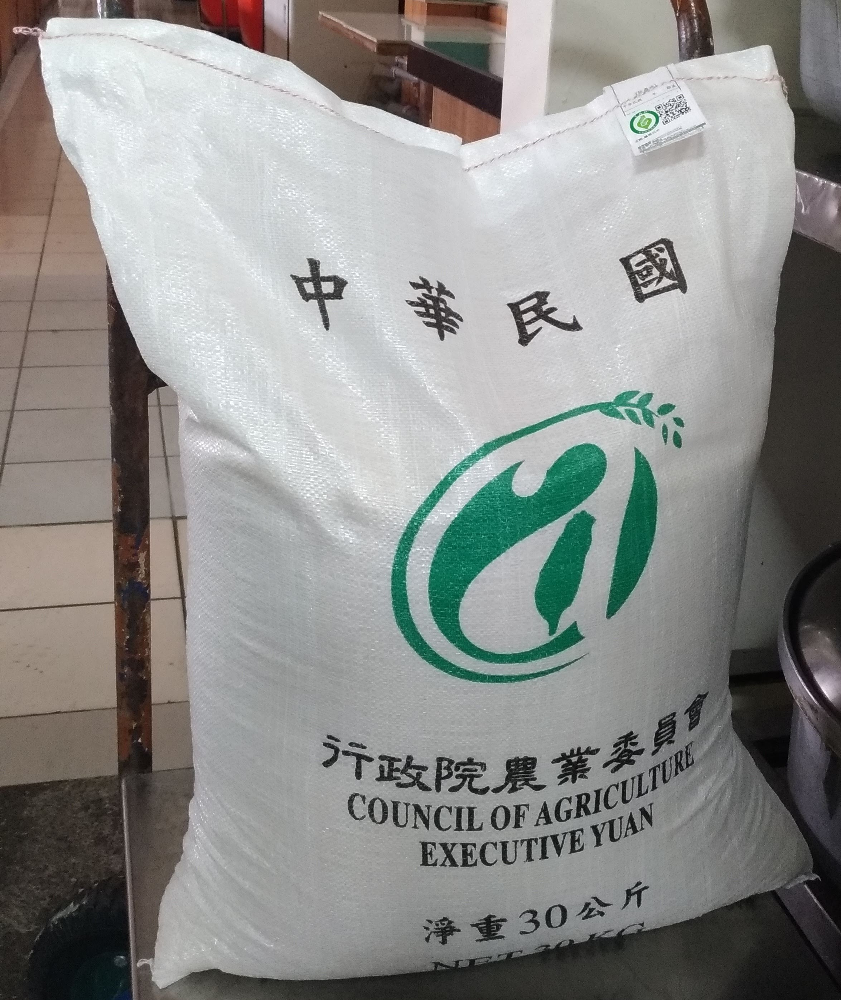

## 前言
恭喜我們補充兵之旅到第四篇了！（拍手）沒意外的話，這篇會是最後一篇補充兵之旅的內容，除非之後我同梯或者誰看完後，希望我可以再補充或者哪邊有錯誤。也希望這篇文章是最後一篇在講有關於我軍旅生涯的文章。如果還有下一篇，可能是我被教召了。（拜託不要）但是，教召補充兵要幹嘛我也不知道，反正班長們有說有可能還是會教召補充兵。

不過，距離我結訓已歷經兩週左右，很多內容只能靠我現在當下的回憶。畢竟是回憶，多少會有一些出入或缺失。畢竟沒有在結訓那時候就完成這四篇文章。但我還是會盡量回憶一下那十二天到底都度過了什麼事情。

在前面的三篇中，我大體上已經論述玩了補充兵的所有工作內容。所以這篇主要會是偏重在一些小日常以及有趣的事情，完全就是我個人回憶的部分。所以說，這篇請當成故事來看就好，完全不適用於任何人準備要當或想了解補充兵的部分。也可以理解成，基本上當兵都會有不少回憶可以拿出來講的，這篇就是那些回憶們。基本上這篇的文筆會比較輕鬆一點，甚至會有點含媽量偏高。文體基本上也會與前面不太一樣，會分成很多小標題，然後標題內可能只有簡單的說一下。所以說，真的當成故事書來看就好。

## 人類們
俗話說的好：「樹大必有枯枝，人多必有~~白癡~~。」另一句話也說：「一種米養百種人。」這兩句話，大概你會在你人生中每個時刻都會有感觸。不用說當兵，光是去學校上學我都很有這種心得。在高中開始，會因為升學考試大家會被分流到各個地方去。雖然，讀書不一定會是唯一的出入。但是，這些分流可以看出來某些人的特質與特性。在高中以上，大概你身邊會匯聚的人就會因為分流而有一定的同溫層。所以，除非你特別到處跑，不然你就很難再去認識到一些不同階層的人了。請自己好好仔細回想，國中小的同學組成的複雜度是不是通常還是比較高。但是，當兵就是一個你在長大之後，少數會（被迫）認識到來自各地不同階層的人。也因此，到底同梯們長得像是什麼樣子，就很多可以講的事情了。

### 同梯與鄰兵們
首先，我們剛進來時就會被分到各班，並且按身高高低排好。最高的那位會被稱為班頭。班頭很可憐，因為很多事情都會叫班頭。我們班的班頭是一位具有香港國籍的人，剛開始的時候，我都叫他班頭。但是你知道一群男生聚在一起，就會讓一些話題開始歪掉，所以說後來我都叫他烏龜的頭（簡稱）。

我這班的人員組成很有趣，我的兩位鄰兵都是碩畢的學生。一位是臺大光電所，另一位是中科大資工所。除此之外，我們這班還有文藻大學再讀的學生跟會計系等。基本上快要人手一張大學或碩士文憑了。後來有聽說，我們這一梯貌似好像還有臺大醫科的畢業生。是怎樣，這一梯要進來的門檻是有點高。當然還是有一些學歷比較沒那麼高的人，但是他們身後的背景都挺誇張的。在撇除學歷與背景以外，我這樣聽一圈下來基本上每個人都得很多獎，不然就是有很多技能。我到現在還是認為，原來只有我一個平民老百姓，只有我無權無勢嗎？！

基本上，我們這梯除了兩個比較搞一點的人以外，大家人都很好很正常。大家都有成功透露出清澈愚蠢大學生的特性（Ｘ

所以同梯跟鄰兵們沒有什麼要特別介紹的，但是有幾位等等後面會出場的人物的綽號可以記一下：小不點（睡我隔壁的人）、大哥（a.k.a 憫哥）、翔哥（同班的人）。

### 長官們
長官們泛指所有屬於我們連上，但是不是我們這些補充兵的人們。換言之，從士官長、連長、班長、兵全部都是我長官的涵蓋範圍內。

其實長官們沒有什麼好講的，基本上就是你在新兵日記裡面看到的長官們差不多。但是，畢竟大家通常都沒有在記名字，叫自己同梯的人我們都叫號碼的方式。所以我們都會私底下幫他們取綽號，但是因為有些綽號沒有很好聽，所以我只介紹幾個比較有趣的綽號。

因為如果是兵，他們都是已經受過專長訓下部隊的狀態。所以他們身上會別有關於他們專長類別的名稱。所以這些兵的綽號就會跟他們專長類別有關係了，像是：「六六火箭（a.k.a火箭）、汽車駕駛兵、榴彈砲兵。」我對於六六火箭這個綽號給予最高的評價，因為挺好笑的。

至於有一個兵，他的名子裡面有柏青（同音，字我已經忘記了）兩個字，所以我們都會叫他柏青哥。柏青哥可以先記憶一下，因為他就是接收我的三合一的人。我覺得我說的很棒：「這是我們的離別禮物，你看到這罐三合一就會想到我們，所以你一定要收下。」（請不要模仿）

### 班長的故事
因為這個連其實人力資源嚴重不足，所以其實只有兩位士官在裡面工作。一位是姓蔣，另外一位我忘記了。這邊的故事就是有關於另外一位的。

這一位班長人很好，基本上他就是會放我們補休的班長。我自己內心都封他為大天使班長，他人真的很好，真的是大天使。在某一天，他跟我們講了一個故事。

這位班長，他說他帶有前世的記憶，然後他其實有陰陽眼的技能。聽起來超酷，但是我們就很好奇到底他怎麼知道他前世的記憶是真的，班長說：「我有憑著我的記憶回去找過那個地方，真的有找到東西。」他說他進來當兵是有使命的，不過完整的故事我就不打出來了，怕會不會對他有什麼不好的影響。不過，就是一種另類的軍營中都會有的鬼故事大合集，至少我聽得挺開心的。這位班長講了一個很有趣的資訊，他說這個軍營之前其實是納骨塔，所以其實有很多髒東西在這邊。不過，到底是不是真的我就不得而知了。

## 打飯班相關
~~打飯班狗都不當。~~

這句話，一定要記清楚。以下個故事有些真的荒謬到我都不知道從何說起，反正就是很荒謬。

### 永遠喬不定的分工
首先，我們要先recall一下記憶。打飯班由兩班組成，五班跟六班。這時候會發生一件事情，基本上五班的人只會跟五班的人溝通。六班的人也只會跟六班的人溝通。當你看到這句話，你就知道這個一定會出很多的問題，畢竟兩班就會各自為政。然後呢，因為班長在通知事情的時候，會先跟五班的講，再請五班的跟六班的說。這也導致了最一開始分工就會變成一種大亂鬥形式。反正，那時候我秉持著一個原則，哪邊有缺人我就去哪邊幫忙。這也產生了我前面倒了三次廚餘，以及被廚餘潑到的慘案。

後來，兩班的人發現這樣不行，兩邊開始派出人馬進行協商，我們班派出的是班頭，之後是說工作要用輪流的。但是怎麼輪流又一直變來變去，一下說一餐輪一次，一下說一天輪一次。反正我是沒有搞懂過到底要怎麼輪。後來變成我們班班頭在指揮，然後聽說他們好像吵起來了（對，我沒有看到，所以我不知道），之後分工又開始混亂了。這邊可以先知道一個前情提要，反正就是大家都不想要去倒廚餘就對了。然後被班長抓到有人在偷懶，之後班長直接訂了一個分工的規則，把所以工作設定成固定人員負責。

好，這邊前半段看起來很混亂對吧？對，當時就是這麼混亂的一個畫面，基本上我抱持著一個原則，我不參與討論，反正跟我說要幹嘛就好。但是現在有一個穩定版本，就是班長的固定人員制度。好，其實到這邊開始穩定了幾天。只是被分配到去倒廚餘的人會很可憐就是了，畢竟他們就是固定去倒廚餘的人。但是沒關係，至少現在有一個穩定的程式碼可以運行。我那時候都開玩笑說：「這就是所謂一個bug是bug，一推bug是work嗎？！」

這樣安然無恙地過了幾天，某位班長他把我們打飯班的兩個人抓走去當文書公差。正好好死不死就是五班的倒廚餘的兩位。然後又有一位五班的人，他因為一些原因被班長移除打飯班的身分（我到現在都還是覺得這他媽是獎勵吧？？？），所以這時候打飯班少了三位人員。但是大家都不想倒廚餘，這時候班長所訂下的制度就開始鬆動了，然後又是在喬廚餘到底要怎麼輪。這時候我們班換成大哥出馬去跟對方喬。在之後，班長從七班調了三位人員過來支援打飯班。但是這三位到底要支援那些工作，到底要歸誰管又開始混亂了。最後打飯班的工作就在混亂中結束了。

對，我到現在還是不知道我們分工到底是怎麼分的。反正我聽下來有不下七八個版本。就，一個bug是bug，一推bug是work。

### 我說廚餘室鑰匙勒?
首先，廚餘室沒有天花板但是有一個門。這個門是上鎖的，不要問為什麼，他就是上鎖的。然後呢，這個鎖的鑰匙只有三營有，不要問為什麼，就是只有三營有。

在我們這十二天中的週末的時候，三營的人剛好全部都出去放假去了。重點來了，他們負責保管鑰匙的人也放假出去了。基本上整個營區只剩下我們四營有人。所以我們這幾天還是得倒廚餘，畢竟一定會有一些剩菜剩飯。這就產生一個問題，鑰匙就沒有人有辦法拿到了，畢竟保管鑰匙的人不見了。所以說，在星期五的晚上我們因為廚餘室上鎖打不開，所以沒辦法倒廚餘。這時候有兩桶橘色桶子的廚餘，兩桶大概半滿。

這件事情其實很坐牢，因為這產生一件事情，你要推著廚餘從廚餘室經過那一段很長的上坡回到餐廳門口旁邊放著。這件事情要先記住，因為這個動作會重複好幾次。然後班長就有根士官長反映，廚餘室鑰匙的問題。

到了隔天早上，因為早上廚餘量通常比較少，所以不太倒廚餘。但是士官長有說，中午倒廚餘的時候先去安官桌拿廚餘室鑰匙。三營那邊有把鑰匙放在安官桌了。這時候到了中午要去倒廚餘，但是這時候中午走下去後，班長去安官桌拿鑰匙。但是呢！安官桌：「什麼鑰匙我們不知道啊？」，所以中午倒廚餘任務失敗了，因為打不開廚餘室的門。這時候有四桶橘色桶子的廚餘，四桶大概半滿。再把這四桶廚餘推回餐廳旁邊放著。然後呢，班長去跟士官長反映，士官長說晚上去倒廚餘的時候，一樣要去安官桌拿鑰匙，這次一定會有鑰匙。所以晚上的時候，我們廚餘小隊再次出發（這次我被加進來了，前面我沒有去）。這時候四桶大概都三分之二滿的廚餘，浩浩蕩蕩的推下去倒廚餘室，班長去安官桌那邊拿鑰匙。重點來了，安官桌的人說他們沒有鑰匙。對，對，對！！！！！！所以這時候要幹嘛？要再把這四桶廚餘推回去餐廳門口放著。這？

這時候我們像班長請示，廚餘桶能不能直接放在這邊，不然一直推上推下的很麻煩。班長最一開始拒絕，經過一番溝通以及與士官長溝通後，被同意了。這時候到了隔天。對不用懷疑，一個廚餘室鑰匙花了一天多還沒拿到喔！

到了隔天，一樣早上不倒廚餘。在中午的時候，我們廚餘小隊再次出發，帶著兩桶新的廚餘下去廚餘室。到了這次，終於我們拿到了心心念念的廚餘室鑰匙。我們終於可以把我們六桶廚餘給清倉了。當下我有問班長，要不要乾脆你們出去打一把鑰匙放在四營，班長說不行，因為鑰匙只有三營可以擁有。不要問我為什麼，我也不知道。

回到這個故事一開頭，到底為什麼廚餘室要上鎖？這個未解之謎，我到現在還是不知道。

### 謝謝廚餘室客滿了
在面對了前面講倒的廚餘室鑰匙之亂，我們回顧一下前一篇倒廚餘的畫面。其實廚餘室室有可能會客滿的。嘿，我們在這短短的十二天中遇到了一天半廚餘室室客滿的情況。

廚餘室客滿怎麼辦呢？就是門不會開，你就要再把廚餘桶推下去再推上來這個行為。到了最後，我們最後累積了四桶滿的廚餘桶下去倒。

至於這場戰役呢？我還是參加了。沒想到吧？最難最苦的戰役我都在啊！我以為軍歌中的殲滅敵寇說的是人，原來說的是廚餘啊！我又慷慨激昂奔赴戰場了。七次看起來不多，但是前四次是最累的時候，就是最一開始的混段期，就是啥都做所以超類。後面的三次就是前面沒有鑰匙跟這次呢！我真的是再也不想看到那個橘色的桶子了。

所以這邊又多一個未解之謎，為什麼廚餘室客滿沒有人來清？我到現在還是不知道。

### 白飯之亂
還記得前一篇提到的飯桶嗎？基本上那飯桶沒有幾次是有被全部吃完的，基本上我們都會剩下將近一半以上。這些飯，就會使得我們打飯班工作量倍增，所有我們就有人跑去跟伙房反映。這時候確實是從滿滿一桶的白飯，變成大概五分之四桶左右，但是通常還是會剩下不少。在某一天營長看到了剩下這麼多飯，就只是打飯班把白案抬回廚餘，晚餐再繼續吃。所以從那次晚餐開始，我們白飯從一個大飯桶的量，變成一個菜桶的量。

對，這時候白飯從過剩變成過少，其實對於我們打飯班很開心。因為完成了廚餘減量的工作，我們倒廚餘的壓力瞬間少了不少。但是，對於一些比較晚來的零散人員，他們就會遇到白飯不夠的問題。在經過某個督導事件後（後面會講），我們白飯又變成了最原本的一大桶白飯了。瞬間回到光復前，變成超級過剩的狀態。

對於這樣的白飯，我自己都稱這叫做白飯之亂。要馬把打飯班搞死，要馬餓死一些人。我到現在沒有搞懂為什麼沒有中間值，一定只有很多跟很少的情況。

### 淹水的餐廳
俗話說：「民以食為天。」在現代，其實不只要吃飽，更會想要吃好。但是，到底什麼樣叫做吃好，其實跟你的用餐環境會有很大的關係。在原本的餐廳，本來就因為防空洞中的積水導致蚊子隨處可見。基本上，我們每次到餐廳看到最多的就是蚊子。有時候蚊子還會下來停在我們的飯中或者湯中。只能說，在軍中這個條件我覺得已經不錯了。

在某一天早晨，我們打飯班按造日常的工作要去搬餐桶，在我們走下餐廳後我們發現一個驚世駭俗之事。我們的餐廳每個排水孔水都留不下去。有一側的排水孔全部都在噴水出來。在地板上已經有一個不小的水量。看到這樣的一個畫面，我們馬上請示班長要怎麼處理。班長：「一切造舊。」所以我們就在腳邊是水，上面到處都是蚊子飛來飛去的地方，開始我們打飯班的工作與用餐。我人生中還沒有去過水上，但是我成功體驗在水上吃飯的感覺了。

這邊有一個有趣的問題，其實我們餐廳很大一個，前半邊貌似晚點有長官要下來在那邊開會的樣子。不用懷疑，那邊也在淹水。我只能說，長官們肯定都有看到這種荒謬的畫面，但是我猜他們應該習慣了。

至於後來那些水怎麼處理的，我覺得處理方式也是很有國軍的風格。就是採用工人智慧去解決一切的問題。有時候我都在想，原來人多力量大就是這樣的概念嗎？我們打飯班在吃完飯，並且做完打飯班的業務之後。我們就收到指令去拿水桶、掃把、畚箕等，可以去把水移除的工具們。之後我們二十人就浩浩蕩蕩的下去餐廳一杓一杓的把水掃起來，倒到水桶之中。這件事情我一開始以為我們這輩子都掃不完了，但沒想到大概兩三個小時我們就搞定了。完全能夠理解螞蟻們的生活了！

### 大噴水池
我們要先知道，軍中很多東西都十分老舊，甚至可以說上不安全的等級。這其實可以被理解，畢竟沒有什麼錢可以更新很多設備。所以裡面很多東西其實都挺脆弱的。

還記得我前一篇講到的洗手台的設計嗎？如果還記得你就會比較好想像接下來的畫面了。

原本那是一個風平浪靜的午餐時間，打飯班的人們正在認真的洗鍋具。我也趁空檔悠哉悠哉地走去廁所。在我上廁所到一半的時候，我發現外面有許多的雜音，貌似有些大事發生了。我離開廁所後，我就看到連長面色鐵青的帶著小不點跟另外一個打飯班的人在找東西。我當下走上去問他們，他們一直用眼神暗示我離開。當我一轉頭，我看到了一個**一兩層樓高**的水柱在洗手台那邊。然後大家都圍在旁邊，有些人在歡呼，有些人在慌張。這時候聽到樓上的班長有一個指令，就是過去把旁邊所有水龍頭打開，降低水壓。然後我就衝上去了，然後我就全身濕了。後來就是把水閥關掉，之後開另外一區的水閥就落幕了。

這時候，身為一個好奇寶寶，我肯定會好奇到底發生了啥。最後小不點承認是他弄壞的，因為他在跟別人聊天，手放在水樓頭上面，這樣左搖右搖。然後水龍頭的水管就斷掉了。對，不用懷疑，就是這麼脆弱的水管。聽說他們十二月剛修過一次，這一次接訓補充兵讓他們需要再修一次了。至於小不點嗎？後來沒有任何處罰，不過他獲得新稱號：「榜一大哥。」

### 軍團督導
在軍中，有一組神奇的號碼：「1985。」這個故事就是圍繞著這組號碼展開的故事。

在我們剛入伍到退伍之前，班長通常會一直跟你說，不要去打1985。你有問題就直接跟幹部反映，幹部一定會幫你解決。但是如果你去打1985，最後還是我們解決，但是我們會不好做事，自然很多福利就不能放給你們各位。但是到底打1985會造成怎樣的效果？基本上就是你反映的事情，會再從上面反映回來這邊處理。當然如果很嚴重的問題，上面的人會直接下來處理。

在某一天風和日麗的早上，我們在吃早餐的過程中。聽到我們營長在講電話，看起來語氣很無奈。多少有一點點耳聞到一些聲音，貌似八軍團團部那邊，有人要下來看我們餐廳。所以我們這梯補充兵有人去打1985嗎？至少我們這邊沒有人承認過這件情，貌似不是我們的人打的。聽說是另一個營的常備役的人打的，但是為甚麼督導跑來我們這邊呢？這件事情是一個未解之謎。

督導是中午午餐的時候來的，在午餐吃飯前班長有告誡我們，務必要保持安靜表現好一點。後來我們看到那位督導本人，基本上畫面挺有趣的。督導是一個上校，旁邊跟了一群中校的軍官在幫忙紀錄。我們營長也是中校，基本上他就一直到處看看，看到哪邊不爽的地方就會罵我們營長。他要求，我們的菜都一定要放在配膳檯中（因為配膳檯其實只能放四道菜，所以有些會放在桌上）。然後每個桌上都一定要有飯跟湯。（因為原本鍋子不夠，所以飯跟湯是交替放，換言之一個桌上只有一個鍋子。此外，因為打飯班的人都先打完了，所以我們桌上都沒有鍋子。面對打飯班桌上沒有鍋子這件事情，督察非常不爽。他直接問營長這是什麼情況，我們原本想要回答，但是他不准我們答）大概就是在這樣的情況下，一個中午的驚魂記就結束了。基本上就是我們營長一直被電，我們全部都在旁邊看的畫面。

到了晚上，我們要去執行我們打飯班工作的時候。我們看到了一堆鍋子放在我們放鍋子的地方。這些鍋子哪裡來的？不知道。但是基本上我們就是完全滿足督導的要求。使得那天晚上基本上我們打飯班準備上很辛苦。到了隔天早上，那些鍋子又自己消失了，至於那些來如影去無蹤的鍋子到底是甚麼情況，我覺得也成為一個未解之謎。

至於你說，這樣對於我們用餐到底有沒有幫助，我只能說這件事情一點用都沒有。我覺得先把蚊子消滅掉比較重要就是了。

如果你問我的心得，我只能說：「在軍中，階級大一階可以壓死人。」

### 麻布袋 v.s. 廚餘
在我們要結訓的那天中午，那是我們最後一次執行打飯班的工作了！其實大家都很開心，因為真的在看完這些荒謬的故事後，我相信各位都能理解「打飯班狗都不當。」那天在我們開始準備的時候，班長突然拿了一個麻布袋給我們。要說是麻布袋嗎？其實他就是那種裝米的袋子。大概長這樣：

這個袋子，據說是營長指示的一項工作。從這一餐開始，每一餐的廚餘都不可以有水分。至於要怎麼把廚餘的水分濾乾呢？請使用這個麻布袋，把廚餘倒進去後，把廚餘的水分擠出來濾乾。

如果各位對於倒廚餘這件事情有印象，其實我們原本就有一個專門來把廚餘濾乾的籃子。所以我當時就請示班長，我們能不能用那個就好。結論是不行，因為營長的指示是用這個麻布袋把他濾乾。所以說那天就變成，倒廚餘的人在那邊引導大家把廚餘倒進去麻布袋，之後用手把水擠出來，之後再捯回廚餘桶。（還好我那天不用倒廚餘）至於那天廚餘有沒有乾，基本上有拉。不過那天因為濾乾廚餘搞了太久，所以廚餘室已經關門了。

你想問，那些廚餘最後怎麼辦？這樣說好了，我也不知道，畢竟我那天下午就結訓出去了。應該是留守的人得想辦法把他們拿去倒吧？應該？只能說他們也很辛苦呢！

## 其他雜項
好，終於到各種回憶中的最後一個section了！就是最後的其他雜項們！這邊會跟前面有一個很大的差別，基本上可能都會短短的，甚至可能是很多個片段接在一起，不太會是一個脈絡。畢竟這些事件都很小，但是我個人覺得挺好笑的。

### 時間之亂
在軍中，表定其實是早上六點起床。但是呢！因為你要整理內務，你一定會提早的起來，不然高機率會來不及。我跟小不點就達成一個約定，基本上誰起來就順便把對方叫醒。

但是，小不點沒有手錶，所以說基本上他也不知道現在幾點。在裡面很神奇，其實你很容易會在半夜醒來，所以基本上都是我叫小不點比較多。

在某一天晚上，我在半夜的時候感覺到好像有人叫我，我以為是小不點醒來了在問我時間。所以我就轉過去戳他跟他說現在是半夜十二點。然後就繼續睡覺了。在之後呢，我就一路睡，睡到了大概四五點那邊，我看了一下手錶，我以為現在已經五點半了，所以我把小不點搖醒，跟他說五點半了該起來了。後來我先去上廁所後，我發現現在才四點半。至於後續，我大概被小不點罵了一個早上吧。

這邊誠摯推薦各位，手錶一定要帶晚上會發光的那種。我帶的就是最傳統的指針錶。

### 就寢後上廁所
在某一天晚上滑手機的時候，我喝太多飲料了。但是我在就寢之前跑去上了一次廁所，但是上床後十分鐘後我又突然想上廁所了。這時候呢，我猶豫了很久，因為就寢後要去上廁所其實非常麻煩。我一度想要憋到早上睡醒後在去上廁所，不過後來憋不住了。這時候我就決定，我要來執行上廁所這項任務。

因為我睡在上鋪，所以我要先從上鋪下來，穿上我的藍白拖。之後因為寢室在二樓，但是安官桌在一樓，所以我要再從二樓走到一樓去。之後會看到那邊坐著一個班長，這時候就要說：「報告班長，新兵054請示上廁所。」之後班長同意，然後我就跑去上廁所，上完之後再跑回來到那位班長前，說：「報告班長，新兵054上完廁所，請示回寢室。」　之後才可以回到二樓的寢室，之後爬到上鋪，開始睡覺。

這段回憶其實沒甚麼重點，只是想要說，在軍中你連上廁所都不是輕鬆的事情。屬實真的我不會待的習慣。

### 差點被洞八?!
樹大必有枯枝，人多必有~~白癡。~~

基本上，我們補充兵才短短的十二天，我個人見解是認為我們還是乖乖的安全退伍最重要。但是多少會有一兩名刺頭，但是聽起來我們這梯的刺頭是很刺的那種。我們這梯有兩個刺頭，我們都會叫他們皮蛋（因為其他人都是滷蛋）。這兩位皮蛋，一位是頂撞士官長，另一位是不想做打飯班所以在擺爛，後來聽說好像還有頂撞長官。所以說，他們兩位皮蛋就成為了讓長官們的重點對象。所以長官想要洞八他們，但是又因為連坐罰，所以一度謠傳要洞八我們所有人。

對於補充兵來說，我們中間是沒有休假的。換言之，其實我們唯一一次離開營區就是我們結訓那天，所以說他要怎麼洞八我們？就只有一個可能，結訓那天早上八點才放我們走。在你們看到現在，你們應該知道基本上沒有人想要在那種狗地方多待任何一分鐘。此外，如果要多待到隔天早上八點，換言之我們會多出一個晚餐，對於打飯班來說絕對是地獄級的折磨。

不過，就結論來說，後來沒有發生這種慘劇，我們還是順利的下午四點離開營區。

### 快樂的伙房，難吃的飯菜
因為我們是打飯班，所以有時候會看到伙房裡面的人們長什麼樣子，以及他們都在做些甚麼。基本上，他們看起來都挺快樂的，有時候他們會問我們那些菜好不好吃，我是不敢真實回答拉！畢竟我很多菜我都會跳過不吃。

在裡面，基本上有所謂的幾大恐怖菜系，我這邊僅表列一些我有遇到的恐怖菜：
- 防彈豬排（聽說我們的已經很不防彈了）
- 毛沒拔乾淨的豬腳
- 有機率不熟的雞翅
- 螢光咖哩
- 偽裝成茶葉蛋的水煮蛋
- 小白菜全家合集（炒小白菜、小白菜炒紅蘿蔔、小白菜炒辣椒），有時候是酸的 orz

基本上，在裡面我覺得上上籤的只有雞腿一人，雞腿基本上是每次看到我一定會吃的東西，其他東西齁～還是在想想～

我不會說裡面的東西都難以下嚥，但是基本上也不會太好。From班長：「你們一天餐費才多少，不要苛求太多了。」

### 熱水在哪兒
在軍中，基本上規定一定要提供給我們熱水洗澡。尤其我們還在冬天入伍的，沒有洗熱水澡大概明天會倒一片的補充兵。平常因為打飯班的關係，我們會錯開與大部隊共同洗澡的時間。但是某一天，我們收到一項指令，我們需要集合從二營的營舍去一營的營舍洗澡。貌似是因為二營的營舍的熱水器壞掉了。

在第一次的時候，我就索性直接偷偷在二營的營舍洗澡了，反正我覺得洗冷水澡沒關係。後來有去洗了幾次一營營舍的，我的體驗是熱水還是要賭運氣，有時候還是會沒有。有時候我心中會想，我乾脆直接在二營的營舍裡面洗冷水澡就好了，何必跑來跑去呢。

至於說，到底為什麼會沒熱水？基本上就是設備問題了，我覺得不用苛就任何人就是了。

### 各種亂叫
眾所周知，一群男性聚在一起，就會發生集體返祖的現象。所以基本上都會在裡面各種的亂叫，像是用高音叫同梯的名字啊，或者是亂唱一些中國的紅歌啊。或者各種取錯號亂叫阿。反正就是一堆噪音就是了，這邊我沒有想講什麼。只是想要跟各位分享，一群男人關在裡面會變成猴子這件事情。

### 神秘的巨龍
在某一天晚上，我聽到廁所那邊有人在叫。不久後我就聽到有人說，在廁所中看到了一條巨龍。

甚麼是巨龍呢？就是有一條形狀非常完美且長的大便，靜靜的躺在蹲式廁所的右邊。這邊我們要先知道另外一個前提，就是廁所的門是往內開的。換言之，如果你開門開太大力，你就會看到巨龍被門推著走。

至於巨龍具體長怎樣，我沒有去看。他是誰召喚出來的，也沒有人知道。最後巨龍怎麼被消滅的，這件事情也不得而知了。

## 給其他人的建議
其實為什麼我會有這個起心動念想要去寫下補充兵的回憶錄呢？其實除了我想把這些事情記錄下來，當然另一個層次就是可以提供給所有無論是常備役、替代役或補充兵的準備入伍的人一些參考。其實我在這十二天，我最大的一個心得就是兩個字：「服從。」不要去思考到底這件事情對不對，更不要去思考有沒有更好的做法，反正上面的人要你幹嘛就幹嘛。

實在話，我也贊同一件事情，臺灣現行的軍事訓練是有很大的改進空間的，雖然我幾乎沒有受到軍事訓練，但是多少在裡面會看到一些人在訓練。在軍中環境不夠好的情況下，我相信也很難吸引足夠優秀的人才加入國軍。但是，作為一名訓員，不要想太多，安全順利退伍是最重要的事情。

在第一篇中，我有講到我有帶進去的東西，但是我在重新整理一下我覺得真的很有需要帶的東西：

- 證件們（身分證、健保卡、學生證（拿來當悠遊卡用））
- 補充兵徵集令（務必要帶，不然你就白當兵了）
- 存摺正本封面影本
- 個人印章
- 現金（補充兵大約2000-3000，常備役自己多帶一點畢竟比較久）
- 個人藥品（防曬乳、防蚊液、小護士、平常用藥）
- 刮鬍刀（不是電動的）
- 指針手錶（務必有夜視或螢光功能）
- 密封/塑膠袋 * n（可以多一點）
- 手機（iPhone XR）
- 行動電源
- 充電線
- 三隻筆（紅、藍、黑各一）
- 牙膏、牙刷
- 衛生紙

至於其他東西，我個人建議可以在裡面買。基本上，第一天都會讓訓員去營站買齊一些沒有帶的東西，所以說上面的有些東西也可以自己斟酌。不過有個人偏好的還是全部帶自己的就好，至於完整清單可以參考第一篇，但是可以把一些休閒類的東西拿掉。

如果你是正準備要去當兵的人，那就祝你好運！

## 總結
其實如果去看補充兵之旅這四篇，你會發現這一篇是我拖更了最久的一篇。原因無他，因為我在忙其他東西XDD 基本上我拖到已經距離我入伍快要一個月的時間才完成這份心得。我相信很多東西我一定有所遺漏，所以一切以我個人口述為準（Ｘ

可能這四篇的架構沒有很完整，畢竟他撰寫跨越的時空有點大，並且我在軍中並沒有做一些筆記出來。所以我這四篇打得十分的隨興，基本上就是在打得當下才在想打什麼。尤其是這第四篇，前半段是在二月初完成的，後半段被我拖到農曆新年才完成，而且我現在還在重感冒的狀態，但是我想要趕快把這件事情完成。如果看起來有明顯的段落感，我在此致歉。

其實我覺得，這十二天不會說到生不如死，但是這十二天過後我更加珍惜我現在可以在外面自由的活動。至於這樣的一個補充兵，到底對於我國國防戰力有沒有幫助，我覺得就很見仁見智了。其實我覺得這短短的十二天的軍旅生涯，他並不會帶給我很實質上的改變，可能最多的改變就是我的頭髮吧？但是我相信，這短短的十二天他一定會在我人生中留下一段重要的回憶。

這四篇，希望各位客官看得開心。如果後續我還有甚麼要補充的，我可能會上來在直接編輯我的貼文。補充兵之旅四部曲，就到這邊！下一篇沒意外會繼續更新研究生生存日記，至於內容是什麼，我只能說要開啟一段有趣的旅程了。