## 前言
眾所周知，我非常愛『ユイカ』。你要說我沒有聽其他人其實也不客觀，畢竟要只聽一個歌手的歌屬實窒礙難行。但是基本上我的主推是『ユイカ』。當然有另外兩位副推，但基本上『ユイカ』是唯一一個我會願意放下所有工作去聽的。我平常也身兼各種推廣大使，如果懷疑這個誠心的人，歡迎檢視我個帳IG限動。

如若問我，為何如此愛『ユイカ』？基本上他是我第一個想要認真靜下來認識日本文化的契機，這個契機的延續也是我後來決定赴日雙聯的很大原因。我第一個認真去查的日文單字也是來自於『ユイカ』的歌詞。至於問我為何？可能是因為「
クリスマスの日じゃなくていいから」的唱法跟曲風真的太戳人了，以及我是在聖誕節前夕聽到，~~我有被攻擊到~~。

是以，這個開始時間相對許多人來說很晚。也因為如此我沒有第一次『ユイカ』來臺灣開唱的票。但是後來我每次直播與各種貼文等，我都有積極的在互動。或許可以在很多地方發現我的身影，相信我心之誠必可感動上蒼。

如果你是一名臺灣十六周的學校的大學生，你應該跟我面臨到一樣的問題：「幹，要期末了。」所以說，我為了認真參加演唱會，我特別把很多工作都做在前幾周，也因此我完成了三周沒有休息的挑戰。基本上，我以為會戰死在這些書海中。當然在演唱會前還有發生一些misc的事情，這邊就不贅述，可以參考後面的研究生生存日記？

在我補充兵入伍當日，剛好是『ユイカ』的二十一歲生日，當時在營中笑得很開心，我都懷疑我有嚇到我的鄰兵（~~這傢伙第一天入伍就瘋了~~）。不過，也因為這個消息我才能懷抱希望的度過軍旅生活，細節請參考我的補充兵之旅。

此外，非常感謝我的友人－張詠翔，幫我搶到兩天的票，還有第二天的VIP Pass。在此祝他一生安康。

## Day 0 - 接機
接機。這是一種非常有趣的粉絲文化，基本上就是歌手或偶像抵達你的國家時，一群人在外面歡迎的畫面。你要問為啥？因為愛。

我是一個相對來說十分忙碌的人，基本上我每天都昏天暗地的工作，尤其為了想要再平日空出一天，我前三周基本上以生命為代價，燃燒自己去工作。但是在怎麼擠時間，我也只能排出大約半天的時間，所以我只能祈禱『ユイカ』是下午抵達。這次接機對於我來說有兩個重要的任務：
- 送出我手寫的卡片（本次演唱會會寫三張，這是第一張）
- 拿出我的時針草的水壺給『ユイカ』簽名！！！

此時，有一項重要的問題：「要去哪一個機場？」臺灣國門有許多個，光是北部就有兩個國之門鑰，而且距離十分遙遠。究竟是桃園國際機場還是臺北松山機場？以我的時間情況，我得祈禱是臺北松山機場，不然我大概沒有機會順利抵達。這時候天才的我開始在X上祈禱是臺北松山機場。（十分抱歉打擾大家）

但是祈禱沒用，畢竟還是不知道答案，這時候大天才的我決定翻開覆蓋的魔法卡：「勇敢的人先享受世界！」直接發一則限動詢問這個問題。結果，居然成功得到回應了！非常開心！這邊是接機最一開始讓我超級開心的事情！看來我的誠心真的有感動上蒼~~跟『ユイカ』~~。人生第一次被回！不過居然是被回這個XDDDD 這邊揭開了我要去接機的序幕。
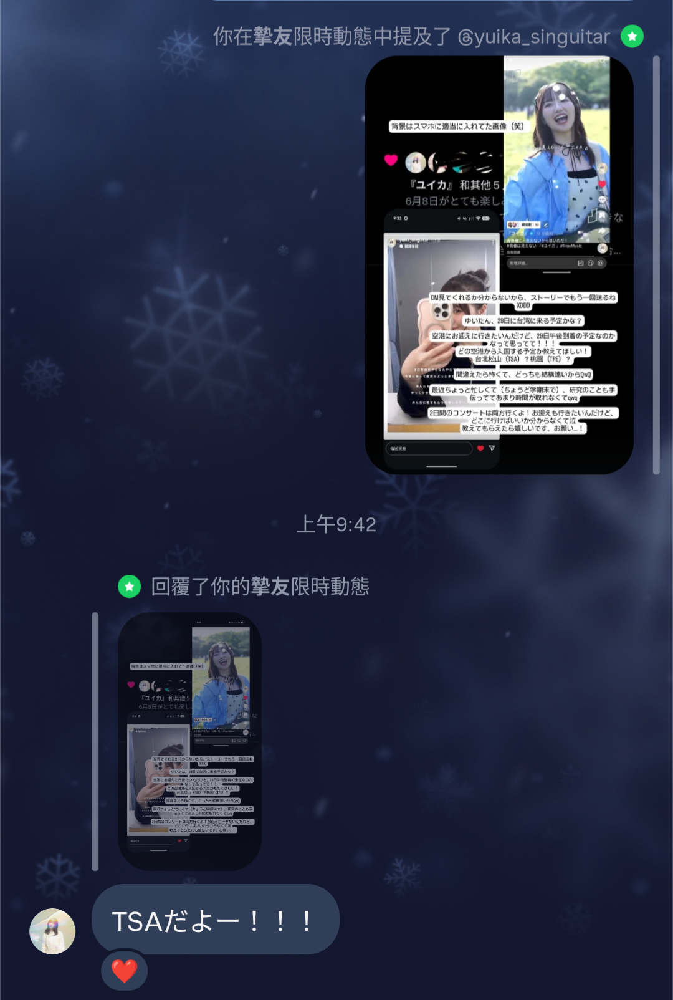

不過，在隔日臺灣的大鴻就有公布『ユイカ』的降落機場跟抵達時間（下午五點@臺北松山機場），所以其實後來這個回覆也沒啥作用XDD 不過還是很開心！！！！畢竟有被回了！！！！！！！

接續前言，我空出了半天的時間。因此，我大約下午一點就從文山區出發前往臺北松山機場。有一說一，文湖線真的是有夠破爛，認真覺得臺北松山機場蓋在這條線上沒有問題嗎？？？

大約兩點左右我就抵達機場，然後發現我忘記刮鬍子，衝去7-11買個刮鬍刀。之後就開始漫長的等待。感謝站在我附近的人們，我後來無聊搭訕了一下，各位都很願意與我聊天。不然當天我可能會站在那邊站到睡著。

大約四點左右工作人員開始慢慢地佈置場地，人也越來越多，開始有慢慢感覺到要來接機的畫面了！在大約下午五點多，『ユイカ』本人出現在機場！以下是我拍到的畫面：
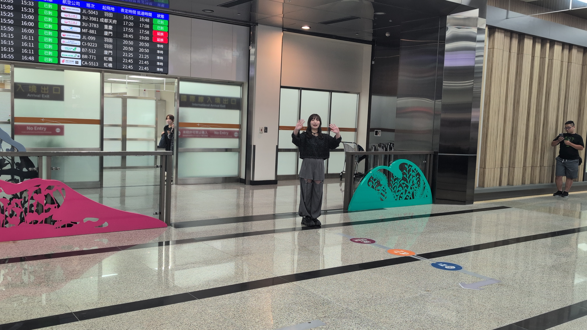

後面就是開始各種拍合照，有一個角度剛好『ユイカ』站的距離我超級近！！！超級開心！！！！好像有一個小妹妹哭了，『ユイカ』還轉身問：「大丈夫ですが？」超級溫柔的！！！之後就是拍完照，大家開始遞出自己的卡片跟物品給『ユイカ』，這時候我就要來嘗試完成我第一項重要的任務：「送出卡片」這個任務有完成，我有送出！！『ユイカ』有收！！！！！！至於簽名的部分就真的因為太多人，『ユイカ』也要早點離開機場回去休息，在人群中推擠下沒有完成。不過至少完成了一項重要任務！！！非常開心！！！！！

至此，完成了我人生第一次接機！！！！
（From 0602: 今天我Meeting報告的時候，分享了這件事情。我老闆：我回臺你都沒有來接機XDDD）

## Day 1 - 0530
第一天，我是2F站席041號。

### 演唱會前

在分享所有第一天心得前，我覺得我應該先說：「Zeep New Taipei 為啥在那鳥位置？？？」我原本想說要透過大眾運輸前往，在前一天晚上查交通路線後發現完全fuck。最後臨時決定改飆Wemo來回，當成這兩天的交通方式。算起來，這應該是我人生中參加第四場的演唱會，基本上都是落在這上半年發生的。所以我並不算是一個非常有經驗的老手？又因為第一天沒有VIP，又受黑貓所託，請我幫忙他朋友代購周邊。為此，我第一天的使命原本設定是買周邊！！尤其看起來官方沒有限購，超怕東西被前面的人買完。原先計畫要早上一大早就衝過去，結果我早上一路快樂的睡到了十點，之後嚇醒！！！！然後就飆Wemo前往。

到了現場，欸不是怎麼都沒人。然後看到一群人聚在一個地方，我就默默的在附近找了一個地方坐下。後來才知道那群人是在排VIP的周邊購買隊伍。然後，一般購買的被拉到外面，然後默默地排起了超長的人龍。非常感謝排在我附近的人，陪我各種亂聊，還遇到都是資訊背景相關的人，大家聊得真的很開心XDD 明明是在排隊，結果聊天度過變得很開心！！！
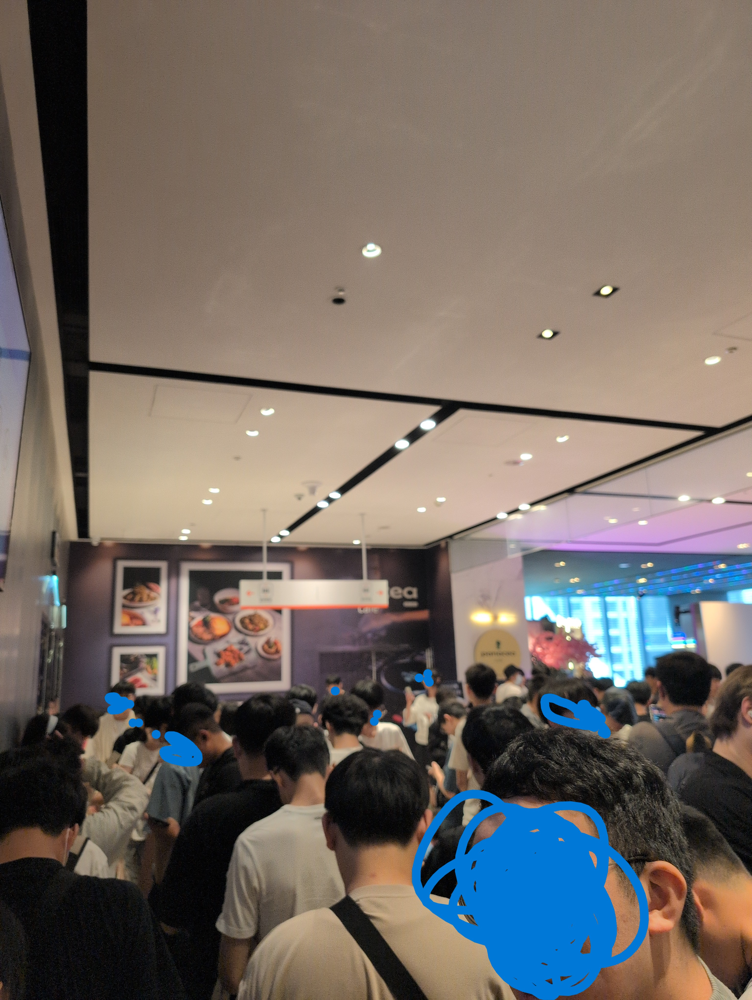

之後就是開始各種亂逛，找人喇賽，拿應援物。除了特別去找小桃拿香蕉（別人發應援，小桃發香蕉XDD），跟拿募資應援外，其他都是隨機遇到聊天的。有時候覺得演唱會前這個時間，真的不知道可以幹嘛，反正我都是到處找人喇賽。某個程度上我算是一種E人？入場前想說紀錄一下我的樣子，如果各位不怕被醜到，歡迎鑑賞下圖：
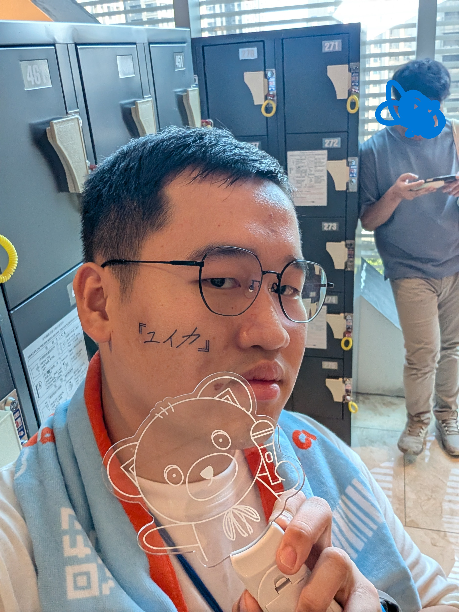

再來就是入場，我原本以為入場後就完全不可以使用手機，結果我發現很多人都有在拍視野跟與手燈合照。所以說，我還是默默地拍了一張視野，以及我的手燈合照。附上一張視野圖：
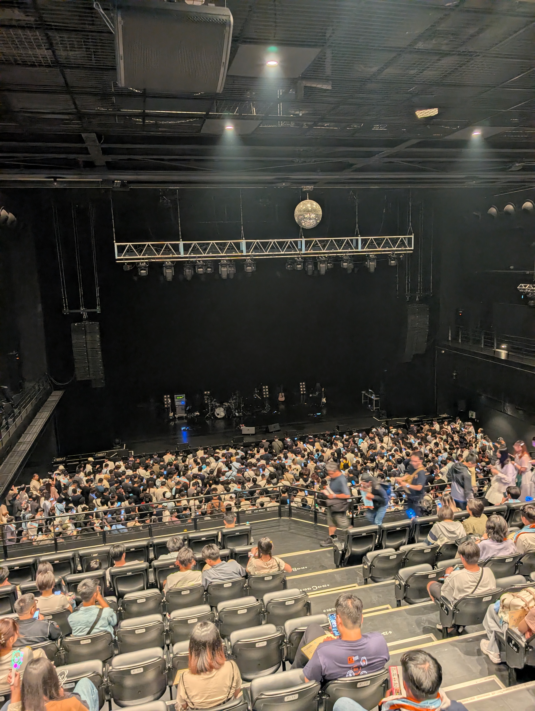
原本以為2F站席，而且我還41號。原本以為要完蛋了，以為今天是一個只能用耳朵專心享受的一天，結果視野很好！！！！還可以趴到2F的桿！！！！重點是人還不多！！！！可以用力應援不用擔心干擾到別人！！！！超級開心！！！！！！！！！！

### 演唱會中

接下來來分享歌單跟心得！不過因為感覺多首的心得可能會類似（？畢竟大概是就好暈好暈好喜歡XDD 所以如果心得重疊或者類似的我會跳過，所以可能這邊會呈現一個頭重腳輕的畫面？反正如果你是ユイナー，類似的歌請自動套入類似心得XD 如果你不是，~~請你先是在繼續看~~。以下是歌單與心得：

- ゆうれいになりたい

    第一首居然是這首！！！！全程都看到『ユイカ』跑來跑去！！還在學幽靈的姿勢！！！！超級可愛的！！！！第一首就被心臟爆擊ㄚㄚㄚ！！！而且『ユイカ』會到處揮手跟大家打招呼！！！他有朝我這個方向揮手！！一定是在跟我打招呼！！！

- そばにいて。

    在第一首心臟爆擊後，第二首居然選そばにいて。這首比較抒情的歌！！順便讓大家稍微冷靜一下（？XD 在大學畢業前，有一段時間我一直在聽這首歌！！！居然能夠在現場聽到！！！超級喜歡！！！這首歌對於我來說也很有感觸，畢竟身邊的人一直來來去去，留下來的人本來就不多了。身邊的朋友普遍都是認識四到七年以上的比較多，希望這些友誼可以繼續延續下去，不要中斷啊！！

- ローズヒップティー

    還記得這首歌剛release的時候，我當天聽到這個曲風驚訝到我直接嘴巴忘記合起來，這首歌超級好聽！！！其實我原本以為這首歌會偏向一首比較抒情的歌（這人的認知可能很有問題），沒想到現場非常的high！！！我現場一直邊聽邊跳起來！！（膝蓋承受了非常大的壓力）我現在聽到這首歌腦袋都會自動浮現出Jump！！Jump！！

- 噓

    在一個過場後，居然是唱「噓」！！！！這首歌可以列在我前幾喜歡的歌之一！！！！很少聽到『ユイカ』唱這首歌！！！沒想到有機會現場聽到！！！！！！我覺得真的太幸福了！！！！在接機中的卡片中，我還許願可以聽到這首歌！！！！沒想到真的可以聽到！！！！現場真的超好聽！！！有感覺到現場氣氛真的正如這首歌的風格的感覺，大家都有點燃起來！！不過有些地方有感覺到『ユイカ』破音XDD（不過畢竟合理，畢竟這首歌真的不好唱，在亞巡選擇唱這首歌真的需要很大的勇氣！）這首歌也是『ユイカ』把自己的一些不同的一面寫進歌詞中，想要講出來給大家聽。所以真的超級愛這首！！！如果想要更加了解『ユイカ』的人一定要去聽！！

- おくすり

    正如這首歌的歌名！『ユイカ』根本就是我的おくすりXD 正如這首歌剛出來的時候，從來沒有想過可以把藥跟愛情兩個事情串聯在一起，還可以寫成一首歌。這時候不可不去讚賞『ユイカ』的創作與聯想力！！！畢竟因為自己身體不好，長期服藥多年，『ユイカ』真的就是我的おくすり，希望這帖藥可以繼續服用下去。在更未來希望可以只服用這個おくすり。

- 17さいのうた。

    身為一名老人？17さいのうた。在家裡的時候我一直很難對於這首歌產生共鳴。或許也有可能是因為我的高中生涯有一半以上都是在疫情中渡過，又加上我並不是一個算是很青春的人？所以說，以前我只覺得好聽但是就是普通。但是第一次在現場聽到，不知道是因為大家的情緒一起渲染，還是因為『ユイカ』的唱功的關係，第一次對於這首歌有共鳴。第一次認真的回首自己高中（含）以前的青春歲月，其實有一點點小泛淚！！但是沒有哭就是了XD

- 紺⾊に憧れて

    我感覺我已經罹患演唱會失憶症了，畢竟已經隔了三天？我只記得有演唱這首，但是因為後面某一首對於我的觸動非常大！我幾乎忘記我那時候在幹嘛了XD 反正也只記得我有泛淚。索性就打一下這首歌我個人的心得？這首歌算是第一張專輯主打的歌，感覺也是第一次『ユイカ』想要用歌曲來跟大家述說自己是誰。如果真的很喜愛『ユイカ』的人，一定要好好了解一下這首歌跟他背後的一些涵義。

- 花⾔葉は調べないで

    因為下一首歌真的太觸動我了，跟前一首歌差不多？我基本上已經罹患演唱會失憶症了。但是我就打一句簡要心得：「我可以送3本のチューリップ給『ユイカ』嗎？」

- 私が選んだもの

    還記得這首歌剛發布的時候，我在實驗室哭到不能自己。（還好當時大家不在？不然大概會被笑死）第一次有機會在現場聽到這首歌，所以也在現場哭到不能自己。這首歌無論是曲風還是歌詞，都感覺到『ユイカ』想要把自己的真心解析給所有聽眾來知道，讓大家知道自己雖然看起來很正面，曾經也面臨過低潮與痛苦。對我來說，或許『ユイカ』想要向大家傳達，就算是他這樣一個外表很積極正向的人，人生中都會面臨到很多的挑戰與痛苦，但是還是要認真的選擇與度過自己的人生，不要留下遺憾。希望大家能夠被這首歌激勵，努力的面對自己的人生。魯迅於記念劉和珍君中曾言：「真的猛士，敢於直面慘淡的人生，敢於正視淋漓的鮮血。」在我看來，這首歌想要表達得意思與這段話類似。這樣的解讀或許有點藍色窗簾？至少我是這樣想的。也只有真的經歷過許多風雨之人，才能夠對於人生有一定程度的感觸。這段心得打得好像有點離題了，我還打到有泛淚，不知所云。

- ラストティーン

    在現場聽的時候，再次有被『ユイカ』的演唱功力以及情緒渲染到。這首歌最後一段歌詞：「誰かの何かになれる、そんなやつになりたい。」希望『ユイカ』可以知道他已經成為能夠為了某人帶來了什麼的人。在演唱會現場唱這首歌的時候，我想起了一段往事。曾經有小朋友問我：「什麼叫做長大？」這個問題，在我人生中不同階段都有不同答案。高中時候的我，或許會回答：「當你可以自由的時候。」如果是大學的我，我會回答：「當你面對許多的決定，你是最後決定者，而且你得為你的決定負起責任的時候。」或許什麼是長大，這題沒有答案。或許我們都會長大，但是長大或許也不代表一定要改變，只要能夠成為自己想像中的大人就好。或許，現在問我這題的答案，我會回答：「只要你成為你想像中的人，你就長大了。」

- 恋泥棒。

    這首歌，算是『ユイカ』早期的歌中，我很喜歡的一首之一！！！雖然最一開始的時候，這首歌的歌名會讓我跟ヨルシカ的春泥棒搞混（這不能怪我吧？早期我沒有學日文XD，近期才學的）。這首歌在現場聽跟在家裡聽真的都超級好聽！！！我的心在現場又被『ユイカ』偷走了一次！『ユイカ』你就是恋泥棒！！！

- さんかくゲーム

    身為最新release的新歌，肯定是已經反覆收聽。尤其是SOS那一段！！！真的SOSㄚㄚㄚ！！！！現場看到『ユイカ』比SOS，帶著大家一起比SOS！！我也真的要SOS了！！！！！！只能說：「心臓爆発済 急救不可能」

- （唯一我有印象的MC）

    只要聽到有中文翻譯的MC，就代表有大事要發生。上一次有中文翻譯的MC還是tuki.的演唱會，我直接一個現場大哭一波。這次也是，我也在現場大哭一波。（到底多愛哭）語言，是一種很神奇的東西。我們如果想要別人知道自己的所思所想，只能透過語言表達出來。只要透過語言，就有機會傳達到。在這一段MC中，『ユイカ』再次把自己的內心真心話再次表達出來。正如『ユイカ』所說的，雖然他表面上十分樂觀與開朗，但自己其實也都很難愛上自己。但是希望大家可以透過這次的演唱會，更加多愛自己一點。希望這個Little Love Journey可以成功傳達這件事情。

    人，其實總是最了解的人會是自己。或者說，人了解一個人最多缺點的人，會是自己。也因此，我們從來都很難打從心裡面真心愛上自己這個人。畢竟大家都會知道自己自身的很多缺點。但，人無完人，或許我們要更加愛自己一點，當我們愛自己才有能力去愛別人。這個Little Love Journey一定可以傳達出這個聲音的！！至少我有被傳達到了！！

- お姫様にはなれない

    我覺得在前段的MC後，接上這首歌屬實是真的很作弊。謝謝各位，我直接哭爛。這首歌剛release的時候，我只有小小的泛淚，但是沒有哭出來（就問到底要哭幾次）。這首歌的歌詞中：「私が私をちょっと愛せたから。」完全呼應到前段MC中的內容。或許我們不能成為一個很厲害的人，但是如果能成為自己心中想像的人，或許我們也都能更加愛自己一點。愛上自己才有可能去努力的生活，成為自己想要的人。

**以下為安口曲**

在喊安口的時候，大家默默地拿出在外面有人發的應援手福開始舉。『ユイカ』出來看到感覺很開心！！！謝謝製作手幅的人！！！

- ⻘春は⾒えない

    這首歌其實還沒正式release，『ユイカ』也是第一次在現場演唱這首歌。只能說，各位演唱會毛巾記得要帶／買阿。甩毛巾超級熱血，大家一起甩更加熱血。真的很有青春的感覺。沒想到，我這個該感受到青春的時候很不青春的人，第一次感受到青春居然是在演唱會感受到。至於細節，請各位期待0608正式release。這是一首『ユイカ』想要改變自己一直被貼上的只會唱情歌的標籤（雖然明明很多首都不是）。所以請各位一定要去聽，真的很好聽。至少我很喜歡！！！

- 好きだから。

    身為『ユイカ』的出道作以及第一次爆紅的歌。沒想到已經五年了嗎？！在現場我不知道前面哭得太開心還是怎樣，現場聽這首歌的時候我也直接大爆哭。『ユイカ』之所以能走到這邊，一切的起點都源自於這首歌。或許，這首歌不是我最愛的歌，但是絕對是很多人第一次認識『ユイカ』的歌。這一路上走過來，相信只有『ユイカ』能夠知道到底多艱辛。希望『ユイカ』可以一直一直唱下去。

- すないぱー。

    這邊其實『ユイカ』很調皮，跟大家拍完大合照之後，感覺是要結束了，之後突然背景放了這首歌的前奏。全部樂團的成員都馬上再跑回來，然後直接開始唱！！！超級可愛！！！！從來沒有想過有這種操作！！！現場大家氣氛超嗨！！！！不愧是「すないぱー。」這首歌啊！！！真的是很嗨！！！！到現在還記憶猶新。

簡而言之，許願的四首歌有聽到一首：「噓」，現場真的超級好聽！！！超級喜歡！！！然後我大爆哭四次，然後我甩毛巾甩得很開心，回去膝蓋我差點以為要斷掉了。應該要換個姿勢，不應該用膝蓋這樣上下跳，膝蓋回家後有椎心刺骨的痛。

### 演唱會後

在散場的時候，終於成功看到花籃跟電視牆，認真地拍了個照片。非常感謝協助收募資應援的人，大家都辛苦了！！！

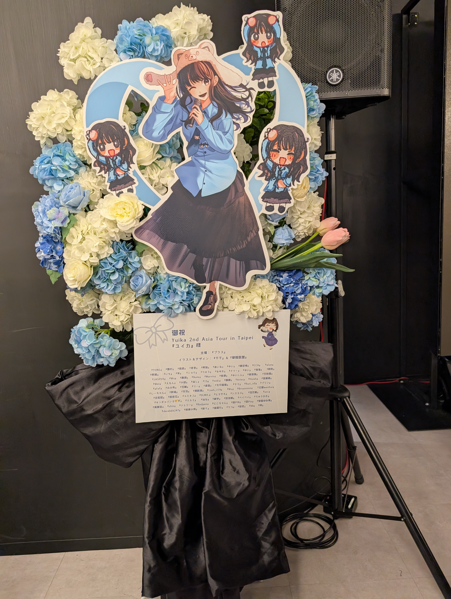
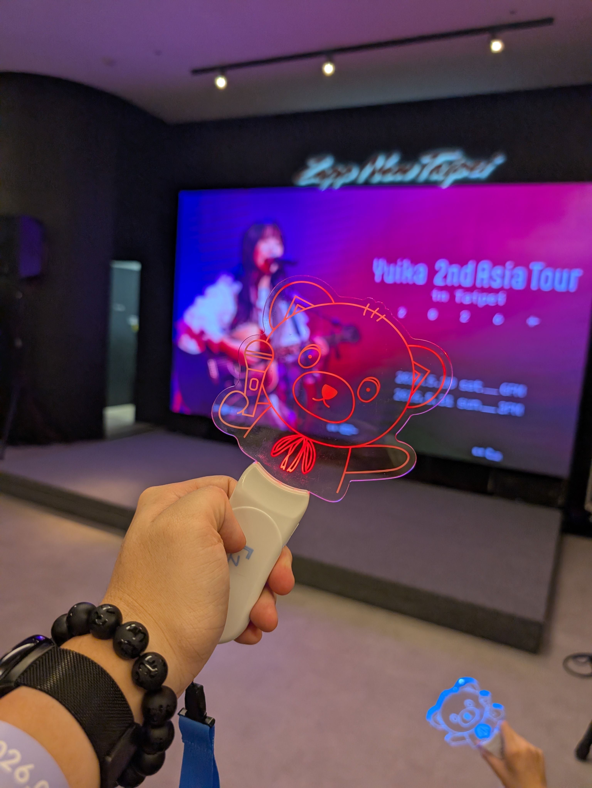

至於第一天，到底我帶回多少戰利品呢？請參考下圖：
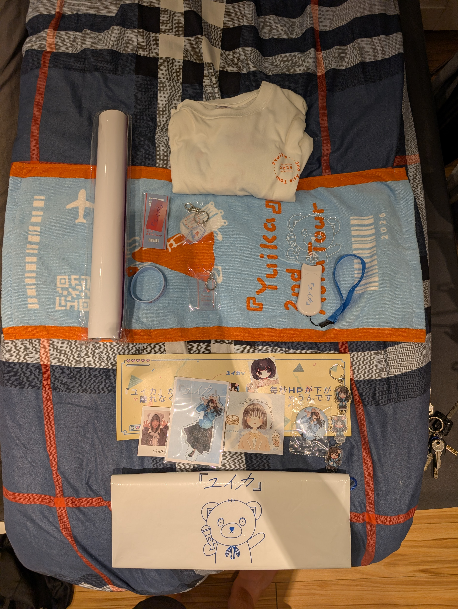
根本幾乎全包了嘛！！！！！！！！！！

## Day 2 - 0531
第二天，我是一樓站席，VIP 080號。

### 演唱會前

有鑑於前一天基本上該做的事情都做得差不多了，以及有經驗了，所以相對從容一點。我第一天基本上把周邊買完好了，但是我臨時決定要再買一套貼紙跟一件衣服！所以說！還是一樣提早出發！前往購買周邊！不過因為我有VIP Pass，所以相對而言今天就沒有一定要非常提早出發！最後有順利買到衣服跟周邊！

之後去領VIP福利，人生中第二張『ユイカ』親簽Get！！！！！真的是超級開心！！！！！（第一張是第一張專輯的）

不過因為第一天沒有拍到Zeep的小黑板，所以我決定拿著VIP福利去跟小黑板拍照！
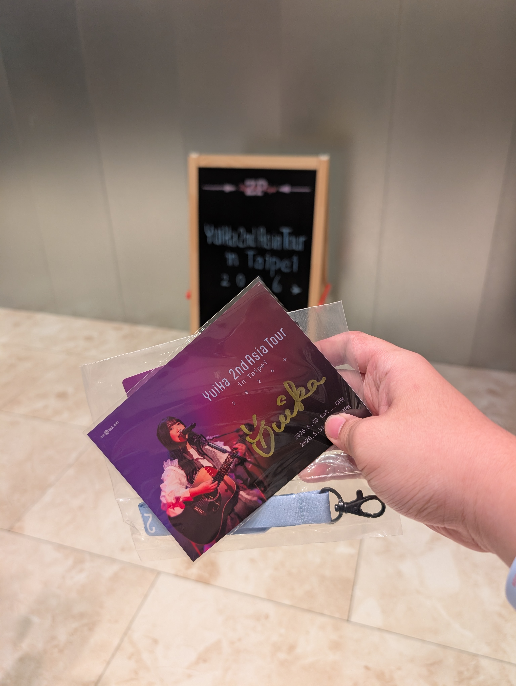

後來就跑去樓下吃飯跟逛街。明明是來看演唱會的，結果跑去看Apple專賣店，這大概也是沒誰了。

不得不說，這次因為VIP Pass的加持！！距離超近！！！！超級開心！！！！可以這麼近的欣賞『ユイカ』的真容！！！以下附上一張當天的視野圖：
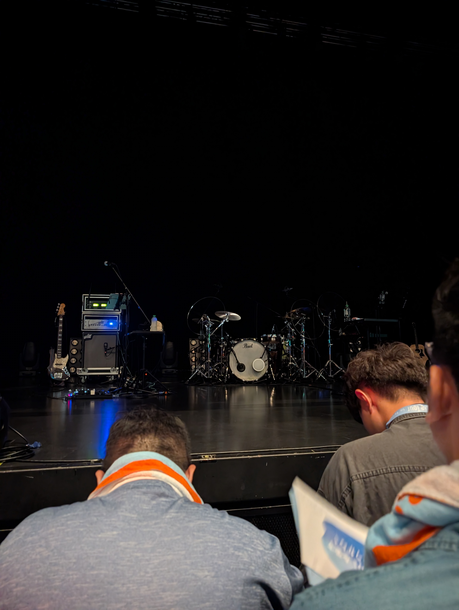

至於第二天我長怎樣，請參考下圖：
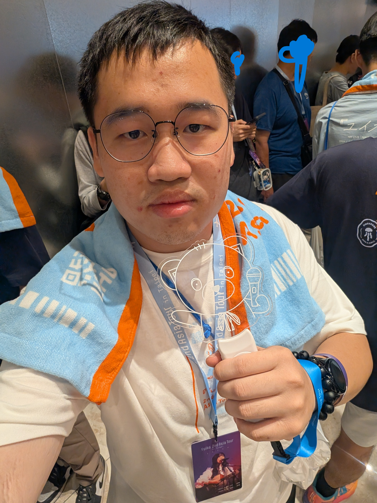

### 演唱會中

基本上因為歌單跟昨天一樣，所以心得請參考[第一天的心得](#演唱會中)，這邊基本上只會講跟昨天不太一樣的心得。

- 視角超近

    人生第一次參加演唱會距離這麼近！！！不過因為沒有機會趴桿，所以前面多多少少會有一點阻礙。但是還是可以看到『ユイカ』在我眼前蹦蹦跳跳的！！！！超級開心！！！！！稍微可以聽到『ユイカ』沒有透過麥克風發出來的原聲！！！從來沒有想過居然可以這麼近又這麼久的看到『ユイカ』！！！！！

    如果要我說唯一的小遺憾，大概只有我斜前方的人有點高，會一直要在他夾縫中求生存！！！

- 氣氛完全不一樣

    因為第一天是在2F站席，有一點天高皇帝遠的情況，所以底下到底都發生了啥我也不太清楚。大概只有純粹自己很High！比較多氣氛的影響都是源自於『ユイカ』再帶動的部分！但是今天在一樓站席，就很更加明顯有感覺到大家在一起High的感覺！！！超級喜歡的！！！！！這就是青春啊！！

    尤其在好きだから。的時候，有感覺到大家一起大合唱的感覺！！！臺灣人人均N1不是在假的。（對不起我在拖平均）氣氛真的超級喜歡！！！！

- 還是快樂爆哭

    演唱會前，想說因為昨天大概都聽過了。大概知道每一個環節在幹嘛，所以應該不會再爆哭一波。但是還是在MC的時候爆哭一波，雖然不像是昨天這麼誇張就是。今天改成很多次都是泛淚。

- 有感覺到全身在震動

    感覺是因為距離太近嗎？第一次感覺到全身的器官以及身體都會隨著音樂在震動，這個體驗有點神奇。不能說上喜歡或者不喜歡，但是挺有趣的。

- 樂團成員都好帥！

    因為角度很近！所以可以看到其他樂團成員的表情與臉！大家都好帥！！！尤其是Bass大哥，真的超級帥的！！！大家演奏的過程中的表情都超級認真，而且感覺很認真享受在表演中！！尤其是甩毛巾那一段，Bass大哥甩的超認真！！超級熱血。

### VIP歡送會

因為第二天我是VIP，所以有一個福利是可以參加粉絲歡送會。原本其實我沒有搞懂這個東西在幹嘛，不過沒關係！馬上就會知道答案！！！在等待VIP歡送會的時候，默默地在場拍了張照片：
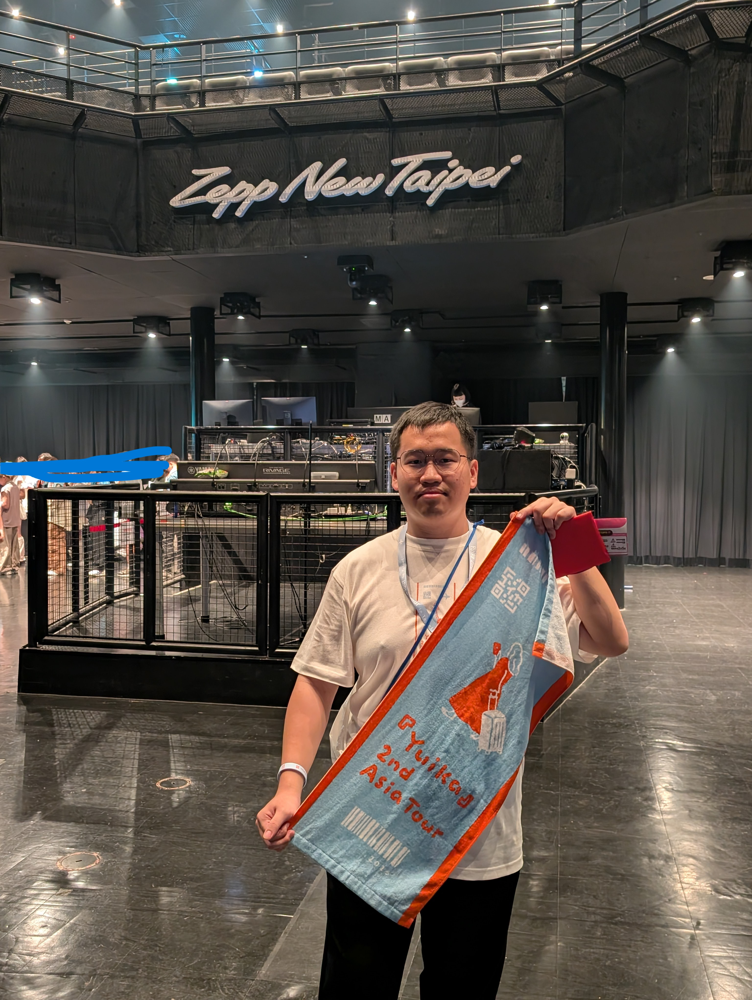

沒想到最後是VIP一個一個出場，『ユイカ』在旁邊的小棚子跟大家說再見跟簡單互動一下！！！！！剛好我第二天想要送出的卡片還沒有送出去，所以就在現場遞給『ユイカ』，我遞了，她收了！！！！！！超級開心！！！！！！！我原本遞完卡片就要離開了！結果『ユイカ』突然說：「我剛剛有看到你的IG 限動喔！」超級開心！！！！但是我被嚇到忘記反應（畢竟原本想說遞完卡片就要跑了，很害羞啦！！！），有點小可惜......但是至少我好樣有被『ユイカ』給記住我是誰了嗎？很開心就是了！！！！真的歡送會真的超級開心！！！！！有買VIP Pass是對的！！！！

### 演場會後
因為昨天都拍完照了，所以歡送會後我就整理一下東西就離開了。附上一張遞二天的戰利品圖：
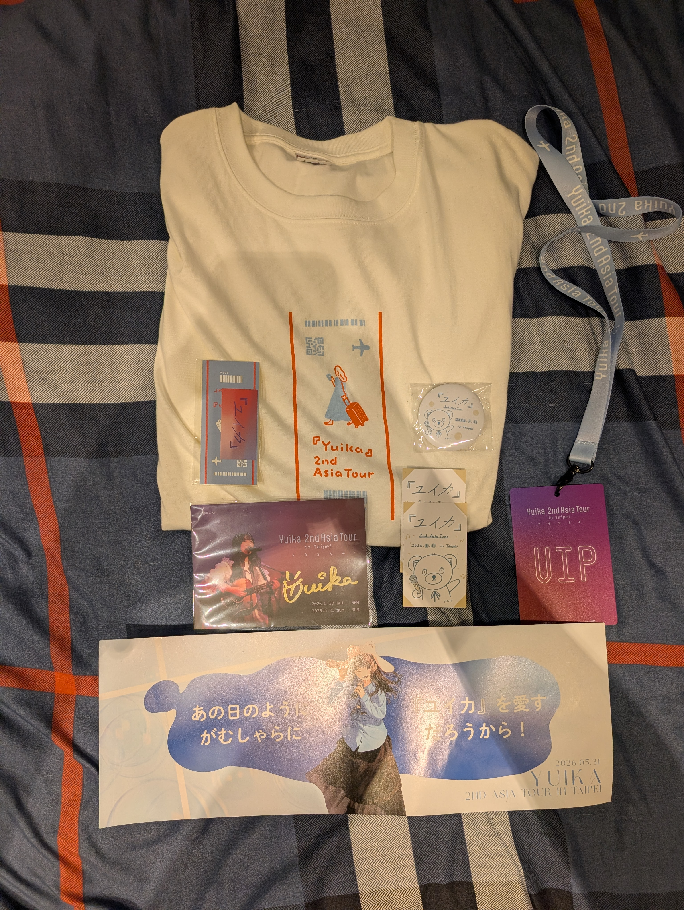

還是再次感謝做手幅以及發給我應援物的各位！！！我會好好收藏的！！！

## 其他感想

前面大概已經講完了全部有關於這次『ユイカ』2nd Asia Tour in Taipei的心得了，以下單純是一些雜項。或許會包含一下我認為可以做得更好的事情？畢竟正所謂，愛之深責之切。『ユイカ』畢竟是我最主要的主推，所以我一定會用我最嚴格的標準與心得去檢視這些事情。如果不喜，請自動跳過本節。至於你要去judge這些評論，就一句話這是我的個人見解。

- 關於接機

    我個人認為，如果主辦單位想要公布接機資訊，就應該善盡維安責任。前半段其實還好，畢竟大家都是站在圍欄之中。但，當『ユイカ』開始慢慢離開要走向車子時，主辦單位應該要控管好人流或者先設定好安全邊界。雖然我沒有馬上跟過去，但是我明顯有感覺到推擠的情況，這並不是一個良善的情況。如若發生踩踏事件，這會使得這一個喜事成為悲劇。個人之見解認為此為主辦單位之過。

    主辦單位作為臺灣的公司，必然要對於臺灣之風土民情有一定之程度了解。當官方公布了這樣的消息，必然會使得人數增加以及路人參與進來。應該在維安跟控管上要再重新審視一次，前半段很棒！後半段畫面真的很亂。

- 關於排周邊

    也是繼承前一段所說，主辦單位是一個臺灣的公司，必然要清晰了解與審視臺灣之民情。當今天你不限購，必然會有很多人提早非常多去排隊。主辦單位應該要在一開始先預期到這件事情的發生先做應對。很明顯的我在第一天看到的，就是對於一般周邊購買的隊伍，主辦單位完全沒有預期與預料。這不對。雖然第二天有改善，但是第一天的畫面其實也不該發生，畢竟大鴻也是不是第一次主辦演唱會的公司，這件事情十分不應該。

- 關於人流控管

    我覺得這不能歸咎於主辦單位，而是場地限制問題。但是大家全部都擠在同一層確實是一個問題，畢竟人流屬實不是太少，這會使得動線混亂。我一度以為這邊是沙丁魚罐頭演練區。我不會說這是一個能被解決的問題，但是這確實不是一件好事。雖然這是大型演唱會通常都會遇到的挑戰，如若可以解決掉我會覺得更棒！

- 關於橘色大閃

    你純屬低能，還被『ユイカ』點名，丟不丟臉阿你？我一點都不認為這是正確的事情，畢竟主辦單位都已經禁止這件事情了。

- 剩下一些是想對『ユイカ』說的話

    或許跟這次演唱會關係不大，但是算是我個人一點點的小不舒服跟自我懷疑。首先，歌一點都沒有問題！我都很喜歡！誠如我前面所打的內文！完全都是喜歡的！！！但是，我有兩次自我懷疑到底該不該繼續喜歡下去或者說錯愕的情況。

    第一次是新藝人照的時候，我那時候其實很期待會不會要發表什麼重大消息，畢竟如此認真的宣傳。這個宣傳力度有過之而無不及。結果後來只是新的藝人照。我能理解或許這對於『ユイカ』來說是一個新的階段與開始（或許是想要打破過去很多舊的包袱），只是感覺要用這麼高強度的宣傳力度，應該要搭配一點點其他消息（我知道有新歌的消息，但就是太少）。不然有一點期望很高，但是結果普通的情況。

    第二次是最近新歌的宣傳。其實歌與宣傳方式是好的，只是在宣傳上的short之類的，有日、英以及韓三種不同語言的字幕。不過沒有中文字幕，實在話我有點小小的難過。畢竟我相信中文使用者的市場還是需要開拓的。如果今天只有日文字幕這無可厚非，但既然要選擇增加其他語言的字幕，是不是應該要思考一下中文的可能性。當然與其相似的是MV的cc字幕，其實滿多歌手都慢慢意識到簡／繁體中文的不同。但是『ユイカ』普遍都還是選擇只有簡體中文字幕，我能理解或許認為臺灣市場都會懂日文，但是事實上臺灣還是有很多人不懂日文的。

    補述：我知道第二段發言有點政治敏感與策略考量。有人會跳出來說政治歸政治云云之類的發言，但是很現實面的政治就是生活中的每一件事情。身為一名半政治動物，我認為我會有一點點政治警鈴響是無可厚非的。並非說一定要怎樣，只是這就是我個人見解。但是我並非想要踩得很死，當提及臺灣都使用臺北這個稱呼，我覺得就是一個相對可以被接受的說法了，但是要論當然會有點難過。畢竟這個地方就是中華民國（臺灣）。

## 結語
還是很喜歡這次的『ユイカ』2nd Aisa Tour in Taipei，這一次的Little Love Journey相信一定可以傳達出更多『ユイカ』的美好與可愛的！！！也相信『ユイカ』的歌聲可以繼續傳達出去！！！讓更多人聽到！！！！雖然我在最後做了一點點的小評論，但是整體來說我覺得都還是很棒！！！！大家都很辛苦！！！！

正如『ユイカ』在MC中說的，希望各位都可以更加愛自己一點，我也會朝向這個方向努力的！！！希望『ユイカ』也可以會做到！！！

這次臺灣之行希望『ユイカ』是開心的！！！！希望下次一定還要再來臺灣！！！一定要喔！！！！

我的限動『ユイカ』都有看到！！！我很開心！！！！！希望『ユイカ』有感受到我的喜歡與開心！！！！也希望我的心得與心情可以傳達出去！！！
